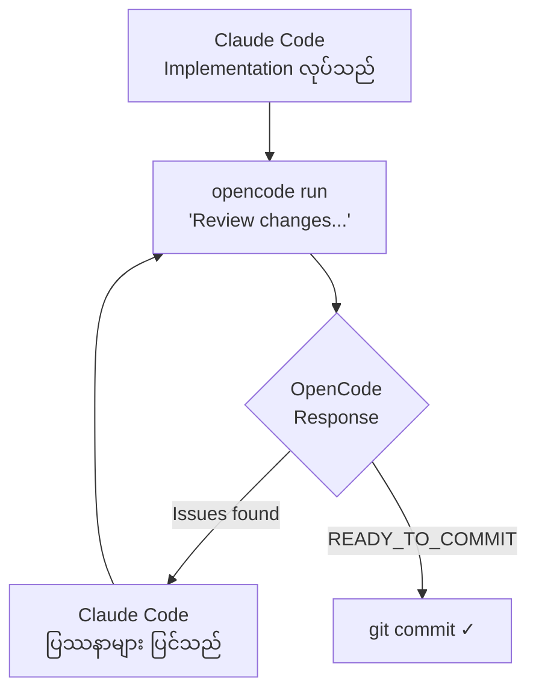

# Claude Code + OpenCode — Collaborative Workflow

## အယူအဆ (Concept)

Claude Code နှင့် OpenCode သည် AI coding tool နှစ်ခု ဖြစ်သည်။ ၎င်းတို့ကို **writer + reviewer** ပုံစံဖြင့် ချိတ်ဆက်အသုံးပြုနိုင်သည်။

```
Claude Code writes → OpenCode reviews → Claude Code fixes → repeat → "READY_TO_COMMIT"
```

ဤ workflow သည် human code review loop ကို AI နှစ်ခုဖြင့် အစားထိုးသည်။ Claude Code က implementation ကို တာဝန်ယူပြီး OpenCode က second opinion အဖြစ် review လုပ်ပေးသည်။

---

## CLAUDE.md Setup

Project ၏ `CLAUDE.md` ထဲတွင် အောက်ပါ workflow ကို ထည့်သွင်းခြင်းဖြင့် Claude Code သည် implementation တိုင်း ပြီးဆုံးသည်နှင့် OpenCode ဖြင့် auto-review လုပ်မည်။

```markdown
## Code Review Workflow
After completing any implementation task:
1. Run `opencode run "Review the changes I just made. List issues or say READY_TO_COMMIT"`
2. If issues are found, fix them and repeat step 1
3. Only stop when OpenCode responds with READY_TO_COMMIT
```

---

## Loop ၏ အလုပ်လုပ်ပုံ



### Step-by-step

1. **Claude Code implements** — feature, fix, refactor ၊ task ၏ implementation ကို ပြီးမြောက်သည်
2. **OpenCode reviews** — `opencode run` ဖြင့် diff/changes ကို စစ်ဆေးပြီး issue list သို့မဟုတ် `READY_TO_COMMIT` response ပြန်သည်
3. **Claude Code fixes** — OpenCode က issue ပေးပါက Claude Code က ပြင်ဆင်သည်
4. **Repeat** — OpenCode က `READY_TO_COMMIT` ဆိုသည်အထိ loop ဆက်လည်သည်
5. **Commit** — ယုံကြည်မှုဖြင့် commit လုပ်နိုင်သည်

---

## Sub-agent ဖြင့် အသုံးပြုခြင်း

Claude Code ၏ sub-agent feature ကို အသုံးပြု၍ review loop ကို background တွင် run နိုင်သည်။

```markdown
## Code Review Workflow (Sub-agent version)
After completing any implementation task:
1. Spawn a sub-agent with: `opencode run "Review the changes I just made. List issues or say READY_TO_COMMIT"`
2. If the sub-agent reports issues, fix them and spawn another review sub-agent
3. Only stop when the review sub-agent responds with READY_TO_COMMIT
```

Sub-agent ကို Claude Code ထဲမှ spawn လုပ်ခြင်းဖြင့် main conversation context ကို clean ထားနိုင်ပြီး review result များကိုသာ main thread သို့ ပြန်လွှဲနိုင်သည်။

---

## Sub-agent တည်ဆောက်နည်း — Step-by-step Guide

### Sub-agent ဆိုတာ ဘာလဲ

Claude Code ထဲမှ spawn လုပ်သည့် သီးခြား agent instance တစ်ခုဖြစ်သည်။ Main agent က task တစ်ခုကို sub-agent အား လွှဲပေးသည်၊ sub-agent က ၎င်း၏ own context တွင် အလုပ်လုပ်ပြီး result ကိုသာ ပြန်ပေးသည်။

```
Main Claude Code
    └── spawns Sub-agent (OpenCode reviewer)
            └── runs opencode review
            └── returns: issues / READY_TO_COMMIT
    └── receives result → fix or commit
```

---

### Step 1 — CLAUDE.md တွင် sub-agent rule ရေးသည်

Sub-agent ကို CLAUDE.md ဖြင့် instruct လုပ်နည်းမှာ သာမန် instruction ရေးသည့်နည်းနှင့် တူသည်။ "spawn a sub-agent" ဟု ဖော်ပြပါ။

```markdown
## Code Review Workflow
After completing any implementation task:
1. Spawn a sub-agent to run: `opencode run "Review the changes I just made. List issues or say READY_TO_COMMIT"`
2. Wait for the sub-agent result
3. If issues are found, fix them and spawn a new review sub-agent
4. Only stop when the sub-agent responds with READY_TO_COMMIT
```

---

### Step 2 — Custom sub-agent file တည်ဆောက်သည် (optional)

Reusable sub-agent တစ်ခု တည်ဆောက်လိုပါက `.claude/agents/` directory ထဲတွင် markdown file တစ်ခု ဖန်တီးနိုင်သည်။

**Directory structure:**
```
your-project/
  .claude/
    agents/
      opencode-reviewer.md    ← sub-agent definition
  CLAUDE.md
```

**`.claude/agents/opencode-reviewer.md` ဥပမာ:**
```markdown
---
name: opencode-reviewer
description: Use this agent to review code changes with OpenCode after implementation. Returns issues list or READY_TO_COMMIT.
---

You are a code review coordinator. Your only job is:
1. Run: `opencode run "Review the changes I just made. List all issues clearly, or respond with exactly: READY_TO_COMMIT"`
2. Return the full output back to the main agent without modification.
```

---

### Step 3 — Main agent မှ sub-agent ကို call လုပ်သည်

CLAUDE.md တွင် custom agent ကို reference လုပ်နိုင်သည်။

```markdown
## Code Review Workflow
After completing any implementation task:
1. Use the `opencode-reviewer` sub-agent to review changes
2. If it returns issues, fix them and run the sub-agent again
3. Stop only when it returns READY_TO_COMMIT
```

သို့မဟုတ် Claude Code session ထဲတွင် directly prompt နိုင်သည်:

```
Use a sub-agent to run opencode and review my latest changes
```

---

### Step 4 — Sub-agent parallel run (advanced)

Sub-agent များကို parallel တွင် run နိုင်သည်။ ဥပမာ — implementation တစ်ချိန်တည်းတွင် test review နှင့် security review ကို သီးခြား sub-agent နှစ်ခုဖြင့် run မည်။

```markdown
## Code Review Workflow
After completing any implementation task, spawn TWO sub-agents in parallel:
1. Sub-agent A: `opencode run "Review for bugs and code quality. List issues or say READY_TO_COMMIT"`
2. Sub-agent B: `opencode run "Review for security issues only. List issues or say READY_TO_COMMIT"`
3. Fix all issues reported by either agent
4. Repeat until both agents respond with READY_TO_COMMIT
```

---

### Sub-agent ၏ ကန့်သတ်ချက်များ

| အချက် | ရှင်းလင်းချက် |
|---|---|
| **Context isolation** | Sub-agent သည် main conversation history မမြင် — task-specific context သာ ပေးရမည် |
| **Tool access** | Sub-agent သည် Bash, Read, Grep စသည့် tools များကို access လုပ်နိုင်သည် |
| **Result only** | Sub-agent ၏ internal steps မပြ — final output သာ main agent သို့ ရောက်သည် |
| **Nesting** | Sub-agent မှ sub-sub-agent ထပ်မံ spawn လုပ်နိုင်သည် (သို့သော် complexity မြင့်သည်) |

---

## ဘာကြောင့် ဤ workflow က အသုံးဝင်သနည်း

| အကျိုးကျေးဇူး | ရှင်းလင်းချက် |
|---|---|
| **Second opinion** | Claude Code က မမြင်သော issue ကို OpenCode က ဖော်ထုတ်နိုင်သည် |
| **Consistent quality gate** | `READY_TO_COMMIT` signal မပေးမချင်း commit မဖြစ် |
| **Automated review loop** | Human review မလိုဘဲ AI နှစ်ခု အချင်းချင်း စစ်ဆေးနိုင်သည် |
| **CLAUDE.md integration** | Project rules ထဲတွင် ထည့်ထားခြင်းဖြင့် task တိုင်းတွင် အလိုအလျောက် အသက်ဝင်သည် |

---

## အသုံးပြုနည်း နမူနာ

### Basic usage (terminal)
```bash
# Claude Code မှ implementation ပြီးနောက် manually run လုပ်ခြင်း
opencode run "Review the changes I just made. List issues or say READY_TO_COMMIT"
```

### CLAUDE.md ထဲတွင် fully automated
```markdown
## Code Review Workflow
After completing any implementation task:
1. Run `opencode run "Review the changes I just made. List issues or say READY_TO_COMMIT"`
2. If issues are found, fix them and repeat step 1
3. Only stop when OpenCode responds with READY_TO_COMMIT
```

ဤ rule ကို CLAUDE.md ထဲသွင်းထားပါက Claude Code သည် task တိုင်းပြီးနောက် OpenCode review ကို အလိုအလျောက် trigger လုပ်မည်။

---

## သတိပြုရမည့် အချက်များ

- `opencode` CLI သည် system PATH တွင် install ဖြစ်နေရမည်
- Review loop သည် infinite မဖြစ်စေရန် maximum retry count သတ်မှတ်ထားနိုင်သည် (ဥပမာ — 3 rounds ပြီးနောက် human review ကို escalate လုပ်ရန် CLAUDE.md တွင် ထည့်ရေးနိုင်သည်)
- OpenCode ၏ response format (**READY_TO_COMMIT** keyword) ကို consistent ဖြစ်အောင် prompt တွင် သေချာ ဖော်ပြရမည်
