# Claude Code Guide

## မာတိကာ

- [Claude Code ဆိုတာ ဘာလဲ?](#claude-code-ဆိုတာ-ဘာလဲ)
- [စတင်ခြင်း](#စတင်ခြင်း)
- [CLAUDE.md - ပရောဂျက် ညွှန်ကြားချက်များ](#claudemd---ပရောဂျက်-ညွှန်ကြားချက်များ)
- [ကျွမ်းကျင်မှုများနှင့် Slash Command များ](#ကျွမ်းကျင်မှုများနှင့်-slash-command-များ)
- [Agents နှင့် Sub Agents](#agents-နှင့်-sub-agents)
- [MCP (Model Context Protocol)](#mcp-model-context-protocol)
- [Multi-Agent လုပ်ငန်းစဉ်များ](#multi-agent-လုပ်ငန်းစဉ်များ)
- [Hooks - အလိုအလျောက်လုပ်ဆောင်ခြင်းနှင့် သက်တမ်းစက်ဝန်း ဖြစ်ရပ်များ](#hooks---အလိုအလျောက်လုပ်ဆောင်ခြင်းနှင့်-သက်တမ်းစက်ဝန်း-ဖြစ်ရပ်များ)
- [Settings နှင့် Configuration](#Settings-နှင့်-Configuration)
- [Memory System](#Memory-System)
- [CLI ရည်ညွှန်းချက်](#cli-ရည်ညွှန်းချက်)
- [IDE ပေါင်းစပ်မှုများ](#ide-ပေါင်းစပ်မှုများ)
- [Project Structure](#project-structure)

---

## Claude Code ဆိုတာ ဘာလဲ?

Claude Code ဆိုတာကို အလွယ်ဆုံး ပြောရရင် Anthropic ကနေ တရားဝင် ထုတ်ပေးထားတဲ့ ကိုယ်ပိုင် Agent လေးတစ်ခုပါ။ ဒီကောင်လေးက ကျွန်တော်တို့ နေ့စဉ်သုံးနေတဲ့ terminal ဒါမှမဟုတ် IDE ထဲမှာ အသင့်ရှိနေပြီးတော့ code တွေကို ဖတ်တာ၊ ရေးတာတင်မကဘဲ အလုပ်တွေကိုပါ auto လုပ်ပေးနိုင်ပါတယ်။ ကျွန်တော်တို့ရဲ့ codebase တစ်ခုလုံးကို နားလည်ထားတဲ့အတွက် သာမန် စကားပြောသလိုမျိုး command တွေ ပေးပြီး ခိုင်းလို့ရတယ်။ ဥပမာ - git workflow တွေကို စီမံခိုင်းတာ၊ တခြား ပြင်ပ API တွေ၊ Service တွေနဲ့ ချိတ်ဆက်ခိုင်းတာမျိုးတွေကို natural language နဲ့တင် ခိုင်းလို့ရသွားပြီပေါ့။

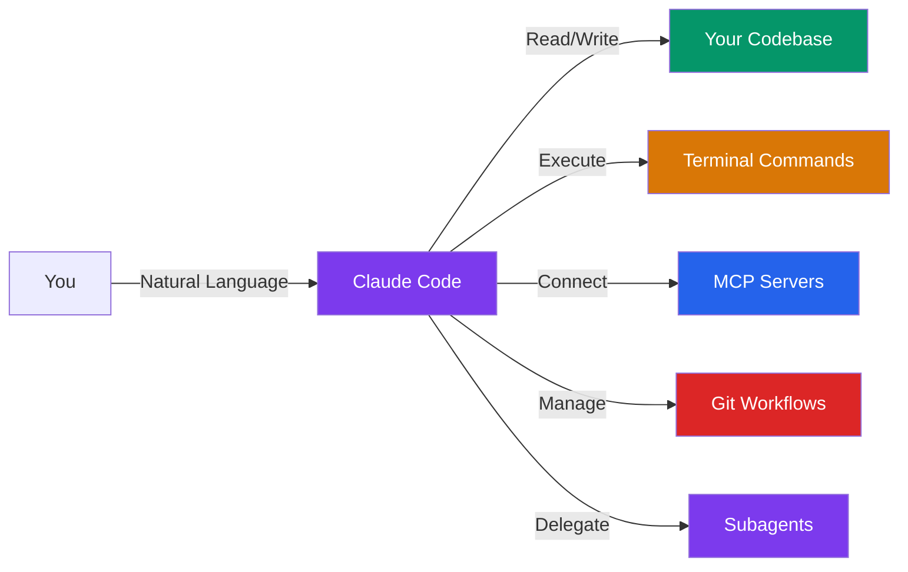

**ဘယ်နေရာတွေမှာ သုံးလို့ရပြီလဲ ဆိုရင်တော့-** CLI, Desktop App (Mac/Windows), Web (claude.ai/code), VS Code နဲ့ JetBrains IDEs တွေမှာ အလွယ်တကူ အသုံးပြုနိုင်ပါပြီ။

---

## စတင်ခြင်း

```bash
# ထည့်သွင်းရန် (macOS / Linux / WSL)
curl -fsSL https://claude.ai/install.sh | bash

# Windows PowerShell
# irm https://claude.ai/install.ps1 | iex

# Session တစ်ခု စတင်ရန်
claude

# သီးသန့် prompt ဖြင့် စတင်ရန် (အပြန်အလှန်တုံ့ပြန်မှုမရှိ)
claude -p "explain this codebase"

# အစီအစဉ်ဆွဲသည့် mode ဖြင့် စတင်ရန် (ဖတ်ရန်သာဖြစ်သော လေ့လာမှု)
claude --permission-mode plan

# ပရောဂျက် ညွှန်ကြားချက်များကို စတင်ရန်
/init
```

---

## CLAUDE.md - ပရောဂျက် ညွှန်ကြားချက်များ

CLAUDE.md ဆိုတာကတော့ ကျွန်တော်တို့ရဲ့ Claude Code ကို ကိုယ်လိုချင်တဲ့အတိုင်း စိတ်ကြိုက်ပြင်ဆင်ဖို့အတွက် အရေးအကြီးဆုံး file ပဲ ဖြစ်ပါတယ်။ သူက သာမန် Markdown file လေးတစ်ခုပါပဲ။ ဒါပေမယ့် session အသစ်စတိုင်းမှာ Claude အတွက် အမြဲတမ်း မှတ်သားထားရမယ့် လမ်းညွှန်ချက်တွေကို ဒီ file ထဲမှာ ရေးပေးထားလို့ ရပါတယ်။

### Multi-level Hierarchical Structure

ဟုတ်ပါတယ်။ CLAUDE.md က ကျွန်တော်တို့ရဲ့ directory tree တစ်ခုလုံးမှာ file တွေကို အဆင့်ဆင့် ခွဲပြီး စီမံခွင့် ပေးထားပါတယ်။ ဆိုလိုတာက Claude ဟာ လက်ရှိရောက်နေတဲ့ directory ကနေ အထက်ကို ပြန်တက်သွားတာပဲ ဖြစ်ဖြစ်၊ ပိုနက်တဲ့ folder တွေထဲ ဝင်သွားတာပဲ ဖြစ်ဖြစ်၊ အဲဒီနေရာတွေမှာရှိတဲ့ CLAUDE.md တွေကိုပါ အလိုအလျောက် ရှာဖွေပြီး ဖတ်ပေးသွားမှာပါ။

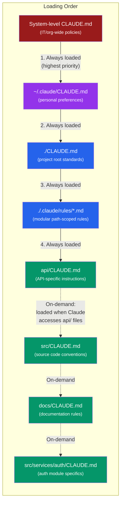

### အဆင့်ပေါင်းများစွာ တင်ခြင်း လုပ်ဆောင်ပုံ

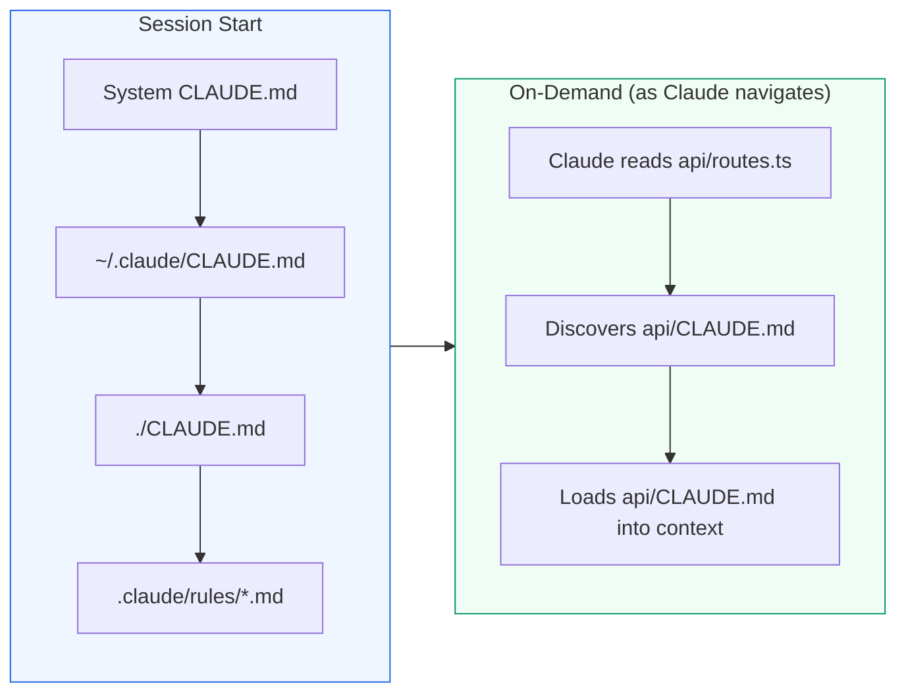

**သူ အလုပ်လုပ်ပုံ အဓိက အချက်တွေကတော့-**
- **မူရင်း file တွေ** (root နဲ့ အထက်က parent directory တွေမှာ ရှိတဲ့ file တွေ) ကိုစတင်ချိန်မှာတင် တစ်ခါတည်း load လုပ်ထားပါတယ်။
- **အောက်ဆင့် file တွေ** (subdirectories တွေထဲက file တွေ) ကိုတော့၊ Claude က အဲဒီ directory ထဲကို ဝင်ရောက်ကိုင်တွယ်တဲ့ အချိန်ကျမှပဲ လိုအပ်သလို load လုပ်ပေးတာပါ။
- **File တွေ အားလုံးကို ပေါင်းစည်းပေးပါတယ်** -- သူတို့က တစ်ခုနဲ့တစ်ခု overwrite လုပ်ပစ်တာမျိုး မဟုတ်ဘဲ၊ ရှိသမျှ rule တွေကို ပေါင်းစပ်ပြီး အလုပ်လုပ်သွားတာပါ။
- Context ကို သက်သာစေဖို့၊ html comment (`<!-- -->`) တွေကိုတော့ အလိုအလျောက် ဖယ်ရှားပေးပါတယ်။

### ဥပမာ- အပြည့်အဝ Multi-level Structure

```
my-project/
  CLAUDE.md                    # Global: build commands, coding standards
  api/
    CLAUDE.md                  # API: REST conventions, auth patterns, error format
    routes/
      CLAUDE.md                # Routes: naming conventions, middleware order
  src/
    CLAUDE.md                  # Source: component patterns, state management
    services/
      CLAUDE.md                # Services: dependency injection, logging rules
      auth/
        CLAUDE.md              # Auth: token handling, session rules, security
    components/
      CLAUDE.md                # Components: prop patterns, styling approach
  docs/
    CLAUDE.md                  # Docs: writing style, structure, terminology
  tests/
    CLAUDE.md                  # Tests: fixture patterns, mocking strategy
  .claude/
    rules/
      typescript.md            # Scoped via paths: "**/*.ts"
      react-components.md      # Scoped via paths: "src/components/**/*.tsx"
      api-handlers.md          # Scoped via paths: "api/**/*.ts"
```

### အဆင့်တစ်ခုစီတွင် ပါဝင်သင့်သည့်အရာများ

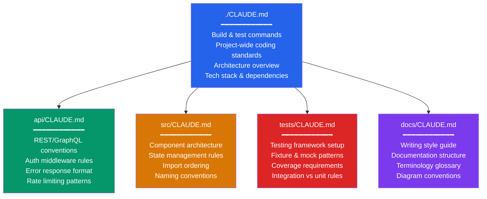

### .claude/rules/ -- လမ်းကြောင်း-သတ်မှတ်ထားသော စည်းမျဉ်းများ

CLAUDE.md file များဖြင့် directory များကို မရှုပ်ထွေးစေဘဲ ပိုမိုအသေးစိတ် ထိန်းချုပ်မှုအတွက် `.claude/rules/` ကို အသုံးပြုပါ-

```yaml
# .claude/rules/api-handlers.md
---
paths: "api/**/*.ts"
---
All API route handlers must:
- Validate input with zod schemas
- Return standard { data, error, meta } response shape
- Use ApiError class for error responses
- Include request ID in all log entries
```

```yaml
# .claude/rules/react-components.md
---
paths: "src/components/**/*.tsx"
---
React components must:
- Use functional components with hooks
- Define props interface above component
- Export named, not default
- Co-locate styles in .module.css files
```

### နယ်ပယ် ဦးစားပေးမှုနှင့် ပေါင်းစည်းခြင်း

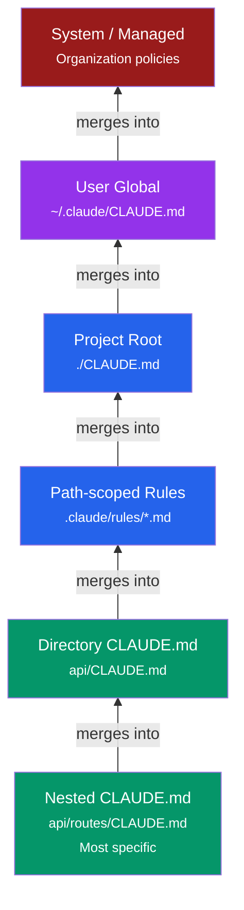

> သတိထားရမယ့် အချက်ကတော့ အဆင့်တိုင်းမှာရှိတဲ့ ဆက်တင်တွေအားလုံး **ပေါင်းစည်းသွားတာ** ဖြစ်ပါတယ်။ တစ်ခုနဲ့ တစ်ခု အစားထိုး ဖျက်ပစ်တာ မဟုတ်ပါဘူး။ ဥပမာ root က CLAUDE.md မှာ "use 2-space indent" လို့ ရေးထားပြီး၊ `api/CLAUDE.md` မှာ "use camelCase for routes" လို့ ရေးထားရင် Claude က အဲဒီ **နှစ်ချက်စလုံးကို** မှတ်ထားပြီး လိုက်နာပေးမှာပါ။

### အကောင်းဆုံး အသုံးချနိုင်မယ့် အလေ့အကျင့်ကောင်းများ (Best Practices)

- File တစ်ခုစီကို ရေးတဲ့အခါ **စာကြောင်း ၂၀၀ ထက် မပိုဖို့** အကြံပြုလိုပါတယ်။ (အရမ်းရှည်သွားရင် context စားသွားပြီး သူ လိုက်နာနိုင်စွမ်း ကျဆင်းသွားတတ်လို့ပါ။)
- ဖတ်ရလွယ်အောင်လို့ markdown header တွေနဲ့ bullet point လေးတွေကို များများ သုံးပေးပါ။
- လမ်းညွှန်ချက် (instruction) တွေပေးတဲ့အခါ **တိကျပြတ်သားဖို့** လိုပါတယ်။ ဟိုလိုလို ဒီလိုလို ရေးတာမျိုး ဖြစ်လို့ မရပါဘူး။
- Project တစ်ခုလုံးနဲ့ဆိုင်တဲ့ စံနှုန်းတွေကို root CLAUDE.md မှာပဲ ထားပါ။ သီးသန့် အပိုင်း (domain) လေးတွေအတွက် စည်းမျဉ်းတွေကိုတော့ သက်ဆိုင်ရာ subdirectories တွေအောက်မှာ ခွဲထားတာ ပိုကောင်းပါတယ်။
- CLAUDE.md တွေကို နေရာတိုင်းမှာ လိုက်မရေးချင်ဘူးဆိုရင်၊ လမ်းကြောင်း (path) အလိုက် သတ်မှတ်လို့ရတဲ့ `.claude/rules/` folder ထဲမှာ သွားထားလို့ ရပါတယ်။
- ကိုယ်ပိုင် root CLAUDE.md တစ်ခုကို အမြန်ဆုံး အစပျိုးပေးဖို့ဆိုရင် `/init` command ကို သုံးကြည့်ပါ။

---

## ကျွမ်းကျင်မှုများနှင့် Slash Command များ

ဒီနေရာမှာ Skill တွေအကြောင်း နည်းနည်း ပြောပြချင်ပါတယ်။ Skill ဆိုတာက Claude ရဲ့ စွမ်းရည်တွေကို ပိုတိုးလာအောင် လုပ်ပေးမယ့်၊ ထပ်ခါထပ်ခါ ပြန်သုံးလို့ရတဲ့ prompt အစုအဝေးလေးတွေပါ။ သူတို့ကို `.md` file လေးတွေနဲ့ ရေးပါတယ်။ ကိုယ်တိုင် manual ခေါ်သုံးချင်ရင် `/skill-name` ဆိုပြီး ခေါ်လို့ရသလို၊ လက်ရှိ အခြေအနေနဲ့ ကိုက်ညီတဲ့အခါမျိုးမှာလည်း Claude ဟာ သူ့ဟာသူ အလိုအလျောက် ခေါ်သုံးသွားမှာ ဖြစ်ပါတယ်။

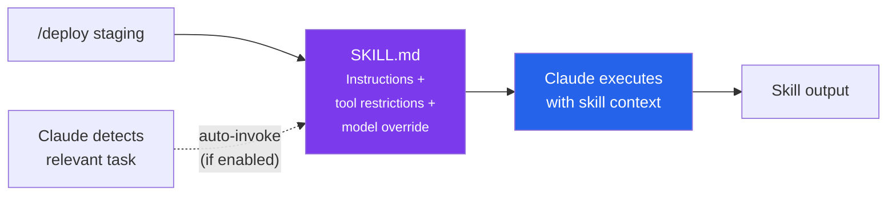

### ပါဝင်ပြီးသား ကျွမ်းကျင်မှုများကို အသုံးပြုခြင်း

| Command | လုပ်ဆောင်ချက် |
|---------|-------------|
| `/commit` | ကောင်းမွန်စွာရေးသားထားသော မက်ဆေ့ဂျ်ဖြင့် git commit တစ်ခုဖန်တီးသည် |
| `/review-pr [number]` | GitHub pull request ကို ပြန်လည်သုံးသပ်သည် |
| `/simplify` | အရည်အသွေးနှင့် ပြန်လည်အသုံးပြုမှုအတွက် ပြောင်းလဲထားသော ကုဒ်များကို ပြန်လည်သုံးသပ်သည် |
| `/batch <instruction>` | အပြိုင်အလုပ်လုပ်သော worktree ၅-၃၀ တွင် အပြောင်းအလဲများကို အသုံးပြုသည် |
| `/loop 5m /test` | သတ်မှတ်ထားသော အချိန်ပိုင်းတစ်ခုတွင် prompt သို့မဟုတ် command ကို လုပ်ဆောင်သည် |
| `/init` | ကုဒ်စစ်ဆေးခြင်းမှတဆင့် ပရောဂျက် CLAUDE.md ကို ဖန်တီးသည် |

### စိတ်ကြိုက် ကျွမ်းကျင်မှုများ ဖန်တီးခြင်း

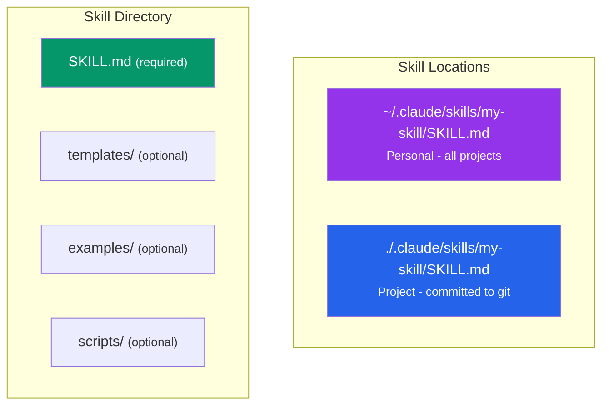

### SKILL.md ပုံစံ

```yaml
---
name: deploy-staging
description: Deploy current branch to staging environment
allowed-tools: Bash, Read
user-invocable: true
argument-hint: [branch-name]
---

Deploy $ARGUMENTS to the staging environment:

1. Run the test suite
2. Build the Docker image
3. Push to staging registry
4. Trigger deployment via `./scripts/deploy.sh staging $ARGUMENTS`
5. Verify health check passes
```

### အဓိက Frontmatter အကွက်များ

| အကွက် | ရည်ရွယ်ချက် |
|-------|---------|
| `name` | `/slash-command` အမည်ဖြစ်လာသည် |
| `description` | မည်သည့်အချိန်တွင် အလိုအလျောက်ခေါ်ယူမည်ကို Claude မည်သို့ဆုံးဖြတ်သည် (အက္ခရာ ၂၅၀ အများဆုံး) |
| `allowed-tools` | ကျွမ်းကျင်မှု မည်သည့်ကိရိယာများကို အသုံးပြုနိုင်သည်ကို ကန့်သတ်သည် |
| `disable-model-invocation` | `true` = လူကိုယ်တိုင် `/invoke` သာ၊ အလိုအလျောက် မလုပ်ဆောင်ပါ |
| `model` | မော်ဒယ်ကို အစားထိုးသည်: `sonnet`, `opus`, `haiku` |
| `context` | `fork` = သီးခြား Sub Agentတွင် လုပ်ဆောင်သည် |
| `paths` | Glob ပုံစံများ -- ကိုက်ညီသော file များအတွက်သာ ကျွမ်းကျင်မှုများကို တင်သည် |

### စာသား အစားထိုးခြင်း

| variable | အစားထိုးမည့်အရာ |
|----------|---------------|
| `$ARGUMENTS` | ကျွမ်းကျင်မှုသို့ ပေးပို့သော args အားလုံး |
| `$1`, `$2` | တိကျသော နေရာအလိုက် arguments များ |
| `${CLAUDE_SKILL_DIR}` | SKILL.md ပါရှိသော Directory |

---

## Agents နှင့် Sub Agents

Agent တွေနဲ့ Subagent (Sub Agent) တွေဆိုတာကတော့၊ သူတို့ကိုယ်ပိုင်သီးသန့် context window၊ tool access တွေနဲ့ ညွှန်ကြားချက်တွေ အသီးသီး ပါဝင်တဲ့ အထူးပြု Claude instance တွေပဲ ဖြစ်ပါတယ်။ ရှင်းရှင်းပြောရရင် Claude Code ဟာ သူ့နောက်ကွယ်မှာ ဒီ agent တွေကို အလိုအလျောက် သုံးနေသလို၊ ကျွန်တော်တို့ ကိုယ်တိုင်လည်း လိုအပ်ရင် လိုအပ်သလို ထပ်ပြီး ဖန်တီး အသုံးပြုလို့ ရပါတယ်။

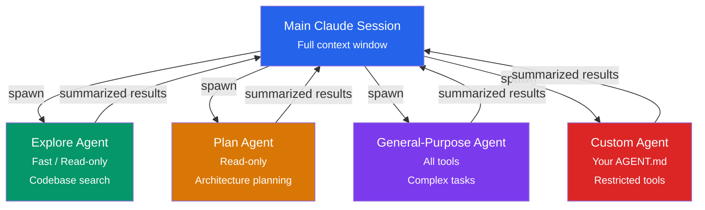

### ပါဝင်ပြီးသား agent အမျိုးအစားများ

| agent | အမြန်နှုန်း | ကိရိယာများ | အသုံးပြုမှု |
|-------|-------|-------|----------|
| **Explore** | မြန်ဆန်သည် (Haiku) | ဖတ်ရန်သာ | Codebase ရှာဖွေခြင်း၊ file ရှာဖွေခြင်း |
| **Plan** | အမွေဆက်ခံသည် | ဖတ်ရန်သာ | ဗိသုကာပုံစံ အစီအစဉ်ဆွဲခြင်း၊ သုတေသန |
| **General-purpose** | အမွေဆက်ခံသည် | အားလုံး | ရှုပ်ထွေးသော multi-step tasks များ |

### စိတ်ကြိုက်  Agents ဖန်တီးခြင်း

agent သတ်မှတ်ချက်များကို ဤနေရာတွင် ထားပါ:

```
./.claude/agents/code-reviewer/AGENT.md    # Project scope
~/.claude/agents/code-reviewer/AGENT.md    # User scope
```

### AGENT.md ပုံစံ

```yaml
---
name: code-reviewer
description: Expert code reviewer focused on security and quality
tools: Read, Grep, Glob, Bash
disallowedTools: Write, Edit
model: sonnet
maxTurns: 20
effort: high
---

You are a senior code reviewer. When invoked:

1. Analyze the code changes
2. Check for security vulnerabilities (OWASP Top 10)
3. Verify error handling and edge cases
4. Assess test coverage
5. Suggest concrete improvements

Provide feedback organized by severity: critical, warning, suggestion.
```

### အဓိက agent အကွက်များ

| အကွက် | ရည်ရွယ်ချက် |
|-------|---------|
| `tools` / `disallowedTools` | ကိရိယာ ဝင်ရောက်ခွင့်ကို ထိန်းချုပ်သည် (ခွင့်ပြုစာရင်း သို့မဟုတ် ငြင်းပယ်စာရင်း) |
| `model` | `sonnet`, `opus`, `haiku`, သို့မဟုတ် `inherit` |
| `maxTurns` | မရပ်တန့်မီ အများဆုံး agent အလှည့်များ |
| `skills` | agent context ထဲသို့ ကြိုတင်တင်ထားမည့် ကျွမ်းကျင်မှုများ |
| `mcpServers` | ဤ agent ဝင်ရောက်နိုင်သော MCP Serverများ |
| `isolation` | git worktree ခွဲခြားခြင်းအတွက် `worktree` |
| `permissionMode` | `default`, `acceptEdits`, `plan`, `dontAsk` |
| `memory` | အမြဲတမ်း memory အတွက် `user`, `project`, သို့မဟုတ် `local` |

###  Agentsကို ခေါ်ယူခြင်း

```
# သဘာဝဘာသာစကား -- Claude မှ ဆုံးဖြတ်သည်
"Use the code-reviewer agent to check my changes"

# @-ဖော်ပြချက် -- သီးခြား agent ကို အတင်းအကျပ်သုံးခိုင်းသည်
@"code-reviewer (agent)" review the auth module

# Session တစ်ခုလုံး -- Session တစ်ခုလုံး ဤ agent ကို သုံးသည်
claude --agent code-reviewer
```

### Sub Agents လုပ်ဆောင်ပုံ

- တစ်ခုစီတွင် ၎င်း၏ကိုယ်ပိုင် **သီးခြား context window** ရှိသည်
- ရလဒ်များကို ပင်မ ဆွေးနွေးမှုသို့ အကျဉ်းချုံး ပြန်ပို့သည်
- ၎င်းတို့သည် အခြား Sub Agents များကို **မပွားနိုင်ပါ** (ထပ်ဆင့်ခြင်းမရှိ)
- ၎င်းတို့တွင် Session များတစ်လျှောက် **အမြဲတမ်း memory ** ရှိနိုင်သည်
- file-လုံခြုံသော အပြိုင်အလုပ်လုပ်ခြင်းအတွက် `isolation: worktree` ကို သုံးပါ

---

## MCP (Model Context Protocol)

MCP ကတော့ standard protocol တစ်ခုကနေတစ်ဆင့် Claude Code ကို အပြင်က tool တွေ၊ database တွေ၊ API တွေနဲ့ အခြားဝန်ဆောင်မှု (services) တွေဆီ ချိတ်ဆက်ပေးတဲ့ အရာပါ။ လွယ်လွယ်ပြောရရင် သူ့ကို Claude ရဲ့ "plugins" တွေလို့ မှတ်ယူထားလို့ ရပါတယ်။

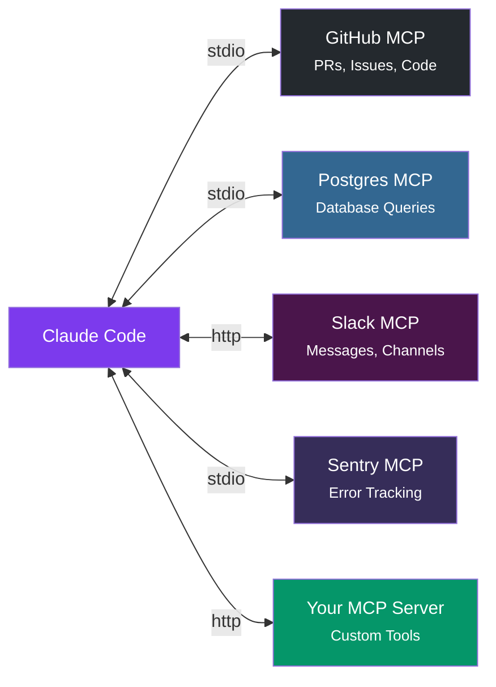

### Structure

MCP Serverများကို `.mcp.json` တွင် ဖွဲ့စည်းထားသည်-

```
./.mcp.json              # Project scope (committed to git)
~/.claude.json           # User scope (all projects)
```

### Structure

```json
{
  "mcpServers": {
    "github": {
      "type": "http",
      "url": "https://api.github.com/mcp",
      "headers": {
        "Authorization": "Bearer $GITHUB_TOKEN"
      }
    },
    "postgres": {
      "type": "stdio",
      "command": "npx",
      "args": ["-y", "@anthropic-ai/mcp-server-postgres"],
      "env": {
        "DATABASE_URL": "$DATABASE_URL"
      }
    },
    "slack": {
      "type": "stdio",
      "command": "npx",
      "args": ["-y", "@anthropic-ai/claude-code-mcp-slack"]
    }
  }
}
```

### Server အမျိုးအစားများ

| အမျိုးအစား | ပို့ဆောင်မှု | မည်သည့်အချိန်တွင် အသုံးပြုရန် |
|------|-----------|------------|
| `stdio` | ဒေသတွင်း သီးခြားလုပ်ငန်းစဉ် | CLI ကိရိယာများ၊ ဒေသတွင်း ဝန်ဆောင်မှုများ |
| `http` | HTTP တောင်းဆိုမှုများ | အဝေးရောက် APIs၊ cloud ဝန်ဆောင်မှုများ |
| `sse` | Server-ပေးပို့သော ဖြစ်ရပ်များ | အချိန်နှင့်တပြေးညီ လွှင့်ထုတ်ခြင်း |

### MCP Serverများကို စီမံခန့်ခွဲခြင်း

```bash
# Serverတစ်ခု ထည့်ရန်
claude mcp add --transport http github https://api.github.com/mcp

# ထည့်သွင်းထားသော Serverများကို စာရင်းပြုစုရန်
claude mcp list

# Serverတစ်ခုကို ဖယ်ရှားရန်
claude mcp remove github

# Session အတွင်း ကြည့်ရှုရန်
/mcp
```

### ပတ်ဝန်းကျင် variable များ

ဖွဲ့စည်းပုံတွင် `$VAR_NAME` ပုံစံကို အသုံးပြုပါ -- variable များကို အလုပ်လုပ်ချိန်တွင် သင့် shell ပတ်ဝန်းကျင်မှ ဖြန့်ကျက်ပေးပါမည်။

---

## Multi-Agent လုပ်ငန်းစဉ်များ

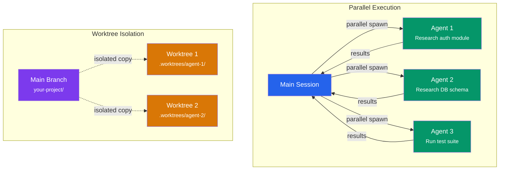

### အပြိုင်အလုပ်လုပ်သော Sub Agents

ကိုယ်လုပ်ချင်တဲ့ အလုပ်တွေပေါ် မူတည်ပြီးတော့ Claude က တစ်ချိန်တည်းမှာ subagent တွေ အများကြီးကို ခွဲထုတ်ပြီး အပြိုင် ခိုင်းစေနိုင်ပါတယ်။ ဥပမာ - 

- Codebase ထဲက မတူညီတဲ့ အစိတ်အပိုင်းတွေကို တစ်ချိန်တည်းမှာ အပြိုင် လေ့လာတာမျိုး၊
- တစ်နေရာမှာ code ပြင်နေတုန်း အခြားတစ်နေရာမှာ test တွေ အပြိုင် run ခိုင်းတာမျိုး၊
- Code review တွေကို နေရာခွဲပြီး တစ်ပြိုင်နက်တည်း လုပ်ခိုင်းတာမျိုးတွေ လုပ်လို့ရပါတယ်။

### Worktree ခွဲခြားခြင်း

အကယ်၍ Agent မှာ `isolation: worktree` လို့ သတ်မှတ်ထားမယ်ဆိုရင်၊ သူတို့ဟာ ကိုယ်ပိုင် သီးသန့် git worktree (repo ရဲ့ ပြီးပြည့်စုံတဲ့ သီးခြား copy တစ်ခု) ကို ရရှိသွားမှာ ဖြစ်ပါတယ်။ အဲဒီတော့ -

```yaml
# In AGENT.md
---
isolation: worktree
---
```

- သူတို့ လုပ်တဲ့ ပြင်ဆင်ချက်တွေက ပင်မ (main) branch ကို လုံးဝ သွားမထိခိုက်တော့ဘူးပေါ့။
- Agent အများကြီးက မတူညီတဲ့ file တွေပေါ်မှာ စိတ်ချလက်ချနဲ့ တစ်ပြိုင်နက် အလုပ်လုပ်နိုင်သွားမယ်။
- ပြီးတော့ သူတို့ တာဝန်ပြီးသွားတဲ့အခါမှာလည်း အဲဒီ copy တွေကို အလိုအလျောက် ရှင်းလင်းပေးသွားမှာပါ။

### background tasks

- လုပ်ဆောင်နေသော အလုပ်တစ်ခုကို move to background လုပ်ရန် **Ctrl+B** ကို နှိပ်ပါ
- ၎င်းလုပ်ဆောင်နေစဉ် သင်ဆက်လက်အလုပ်လုပ်နိုင်သည်
- ၎င်းပြီးဆုံးသောအခါ သင့်အား အကြောင်းကြားပါမည်

### Sub Agents (စမ်းသပ်ဆဲ)

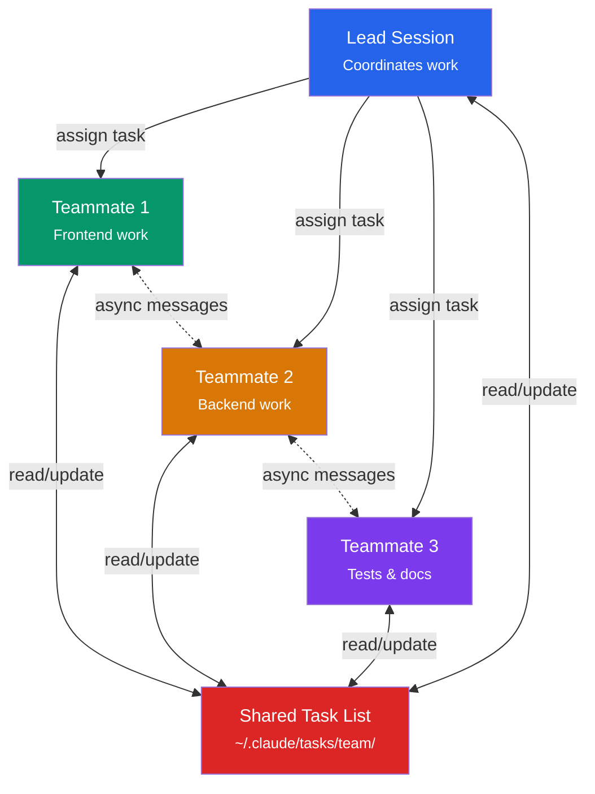

အတူတကွ အလုပ်လုပ်နေသော Claude Code Session များစွာ (ဤ feature သည် စမ်းသပ်ဆဲဖြစ်ပြီး enable လုပ်ရန် `CLAUDE_CODE_EXPERIMENTAL_AGENT_TEAMS=1` ကို သတ်မှတ်ရပါမည်)-

```bash
CLAUDE_CODE_EXPERIMENTAL_AGENT_TEAMS=1 claude
```

- **ခေါင်းဆောင်** Session သည် အလုပ်ကို ညှိနှိုင်းပေးသည်
- **အဖွဲ့ဝင်များ** သည် သီးခြား Claude instance များဖြစ်သည်
-  Agents အကြား မျှဝေထားသော task list နှင့် တစ်ပြိုင်နက်တည်းမဟုတ်သော မက်ဆေ့ဂျ်ပို့ခြင်း

---

## Hooks - အလိုအလျောက်လုပ်ဆောင်ခြင်းနှင့် သက်တမ်းစက်ဝန်း ဖြစ်ရပ်များ

Hooks ဆိုတာက သတ်မှတ်ထားတဲ့ အချိန်အခါလေးတွေ (lifecycle points) မှာ shell command တွေကို အလိုအလျောက် run ပေးတဲ့ ကောင်လေးတွေပါ။ သူတို့က ကျွန်တော်တို့ကို **တိကျသေချာတဲ့ ထိန်းချုပ်မှု** တွေ လုပ်ခွင့်ပေးပါတယ်။ ဆိုလိုတာက LLM က သူ့သဘောနဲ့သူ ဆုံးဖြတ်နေတာမျိုး မဟုတ်ဘဲ၊ ကျွန်တော်တို့ သတ်မှတ်ထားတဲ့ စည်းမျဉ်းတွေအတိုင်း အတိအကျ လုပ်ဆောင်ပေးမယ့် အရာတွေ ဖြစ်ပါတယ်။

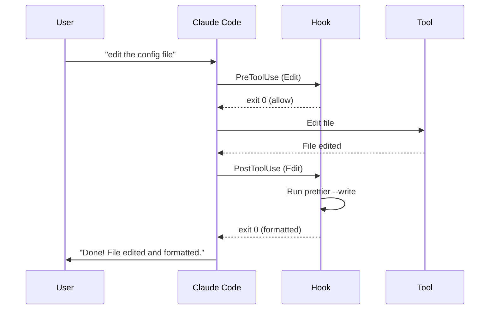

### Structure

Settings  (အသုံးပြုသူ၊ ပရောဂျက် သို့မဟုတ် ဒေသတွင်း အဆင့်) တွင် hooks များကို ထည့်ပါ-

```json
{
  "hooks": {
    "PostToolUse": [
      {
        "matcher": "Edit|Write",
        "hooks": [
          {
            "type": "command",
            "command": "npx prettier --write \"$FILE_PATH\""
          }
        ]
      }
    ]
  }
}
```

### Hook ဖြစ်ရပ်များ

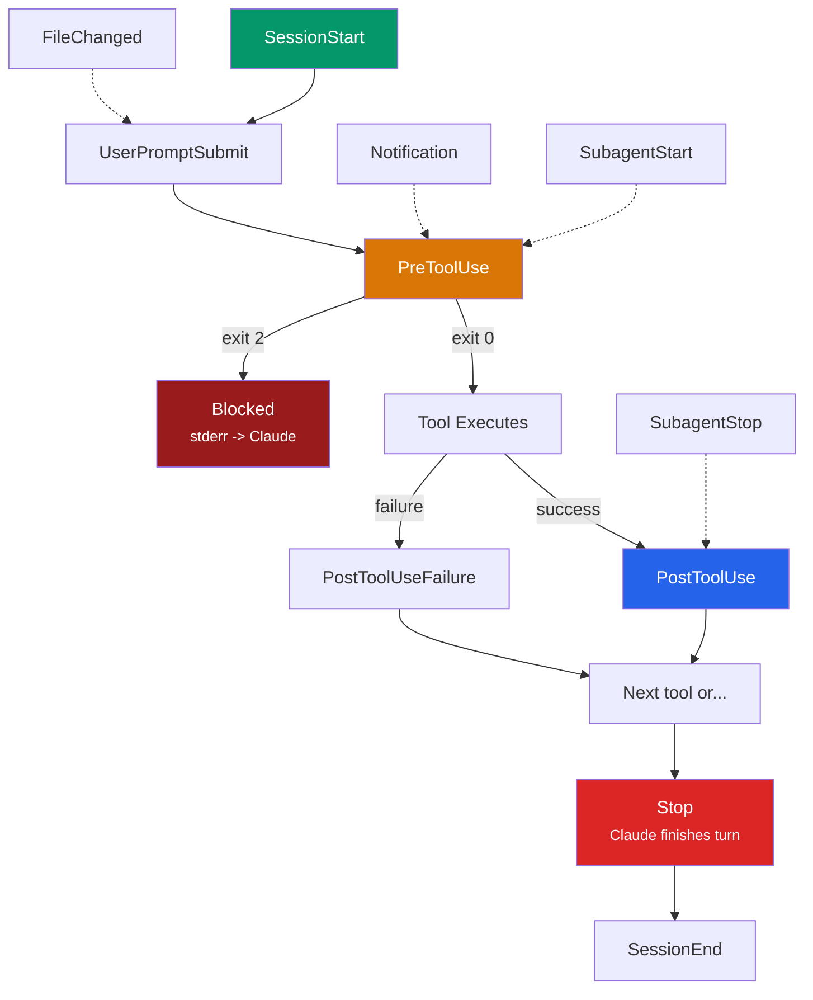

| ဖြစ်ရပ် | မည်သည့်အချိန်တွင် လုပ်ဆောင်သည် |
|-------|--------------|
| `PreToolUse` | ကိရိယာခေါ်ယူမှု မလုပ်ဆောင်မီ |
| `PostToolUse` | ကိရိယာခေါ်ယူမှု အောင်မြင်ပြီးနောက် |
| `PostToolUseFailure` | ကိရိယာခေါ်ယူမှု မအောင်မြင်ပြီးနောက် |
| `UserPromptSubmit` | အသုံးပြုသူ ထည့်သွင်းမှုကို မစီမံမီ |
| `SessionStart` | Session စတင်ခြင်း၊ ပြန်လည်စတင်ခြင်း သို့မဟုတ် ကျစ်လျစ်ခြင်း |
| `Stop` | Claude ၎င်း၏အလှည့်ကို ပြီးဆုံးခြင်း |
| `Notification` | ခွင့်ပြုချက်တောင်းဆိုမှု၊ အားလပ်ချိန် စသည်တို့ |
| `SubagentStart` / `SubagentStop` | agent သက်တမ်းစက်ဝန်း |
| `FileChanged` | စောင့်ကြည့်နေသော file အပြောင်းအလဲများ |

### အများသုံး ပုံစံများ

**ပြင်ဆင်ပြီးနောက် အလိုအလျောက် ပုံစံချခြင်း-**
```json
{
  "PostToolUse": [{
    "matcher": "Edit|Write",
    "hooks": [{"type": "command", "command": "npx prettier --write $FILE_PATH"}]
  }]
}
```

**အန္တရာယ်ရှိသော command များကို ပိတ်ဆို့ခြင်း-**
```json
{
  "PreToolUse": [{
    "matcher": "Bash",
    "hooks": [{
      "type": "command",
      "command": "echo $TOOL_INPUT | grep -qE '(rm -rf|DROP TABLE)' && exit 2 || exit 0"
    }]
  }]
}
```

**ဒက်စတော့ အသိပေးချက်များ-**
```json
{
  "Notification": [{
    "hooks": [{
      "type": "command",
      "command": "osascript -e 'display notification \"Claude needs input\" with title \"Claude Code\"'"
    }]
  }]
}
```

### ထွက်ခွာမှု ကုဒ်များ

| ကုဒ် | လုပ်ဆောင်ချက် |
|------|----------|
| `0` | လုပ်ဆောင်ချက်ကို ပုံမှန်အတိုင်း ဆက်လက်လုပ်ဆောင်သည် |
| `2` | လုပ်ဆောင်ချက်ကို **ပိတ်ဆို့ထားသည်** (stderr ကို Claude သို့ တုံ့ပြန်ချက်အဖြစ် ပေးပို့သည်) |

### Hook အမျိုးအစားများ

| အမျိုးအစား | အသုံးပြုမှု |
|------|----------|
| `command` | Shell scripts |
| `http` | ပြင်ပ webhooks |
| `prompt` | တစ်ကြိမ်တည်း LLM ဆုံးဖြတ်ချက် (Haiku) |
| `agent` | ကိရိယာများဖြင့် အကြိမ်များစွာ အတည်ပြုခြင်း |

---

## Settings နှင့် Configuration

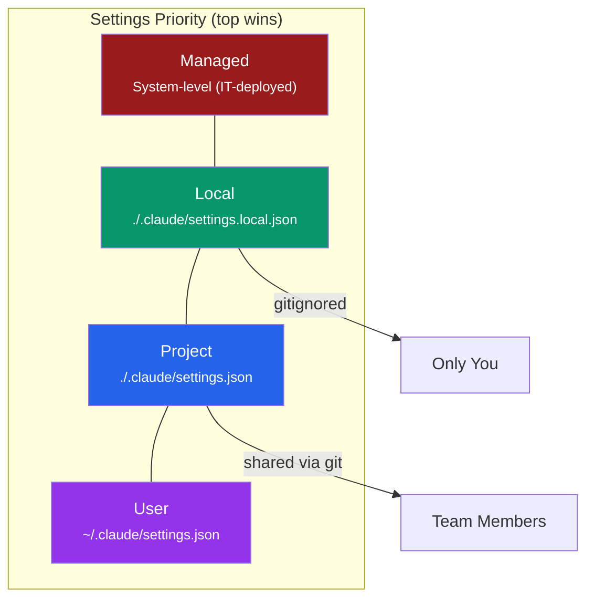

### အဓိက Settings 

```json
{
  "permissions": {
    "allow": ["Bash(npm *)", "Bash(git *)", "Edit(*.ts)"],
    "deny": ["Bash(rm -rf *)"]
  },
  "hooks": {},
  "env": {
    "NODE_ENV": "development"
  }
}
```

### ခွင့်ပြုချက် mode များ


Session အလုပ်လုပ်နေတုန်းမှာ mode တွေကို ပြောင်းချင်ရင်တော့ **Shift+Tab** ကို သုံးပြီး အလွယ်တကူ ပြောင်းလဲနိုင်ပါတယ်။

### ခွင့်ပြုချက် ပုံစံ

```
Bash              # Allow all Bash commands
Bash(npm *)       # Allow only npm subcommands
Bash(git *)       # Allow only git commands
Edit(*.ts)        # Allow editing TypeScript files
Skill(deploy *)   # Allow deploy skill invocations
```

### အသုံးဝင်သော ပတ်ဝန်းကျင် variable များ

| variable | ရည်ရွယ်ချက် |
|----------|---------|
| `CLAUDE_CODE_DISABLE_AUTO_MEMORY=1` | အလိုအလျောက် memory ကို ပိတ်ရန် |
| `CLAUDE_CODE_DISABLE_BACKGROUND_TASKS=1` | background tasks ကို ပိတ်ရန် |
| `CLAUDE_CODE_EXPERIMENTAL_AGENT_TEAMS=1` | Agent Teams feature (စမ်းသပ်ဆဲ) ကို ဖွင့်ရန် |

---

## Memory System

Memory System လို့ခေါ်တဲ့ memory ပိုင်းကို ကြည့်ရအောင်။ Claude Code မှာ session တွေ အသစ်ပြန်စပေမယ့် ဆက်လက် တည်ရှိနေနိုင်တဲ့ memory layer (၂) ခု ရှိပါတယ်။ အဲဒါတွေကတော့ -

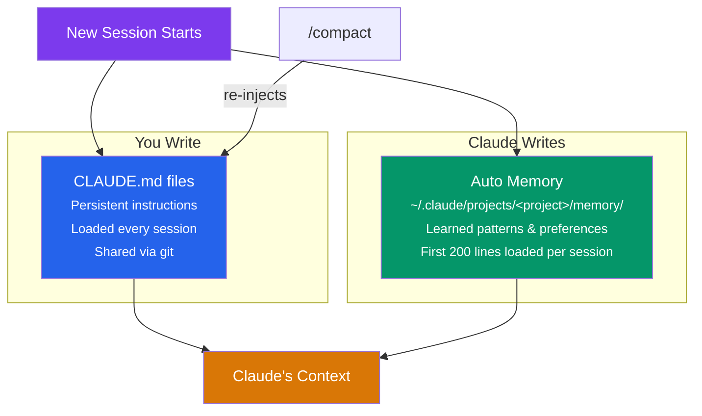

### 1. CLAUDE.md (သင်ရေးသည်)

ဒါကတော့ ကိုယ်တိုင် ရေးသားထားတဲ့ ညွှန်ကြားချက်တွေဖြစ်ပြီး session အသစ်စတိုင်းမှာ ပါဝင်နေမှာ ဖြစ်ပါတယ်။ အသေးစိတ်ကို အပေါ်မှာ ရှင်းပြခဲ့တဲ့ [CLAUDE.md အပိုင်း](#claudemd---ပရောဂျက်-ညွှန်ကြားချက်များ) မှာ ပြန်ကြည့်လို့ ရပါတယ်။

### 2. အလိုအလျောက် memory  (Claude ရေးသည်)

ဒီအပိုင်းမှာတော့ အလုပ်လုပ်ရင်းနဲ့ သူ လေ့လာသိရှိသွားတဲ့ အချက်အလက်တွေကို `~/.claude/projects/<project>/memory/` ဆိုတဲ့ လမ်းကြောင်းအောက်မှာ သူ့ဟာသူ အလိုအလျောက် သိမ်းဆည်းသွားမှာ ဖြစ်ပါတယ်။

```
~/.claude/projects/my-project/memory/
  MEMORY.md              # Index file (first 200 lines loaded each session)
  build-setup.md         # Topic files (loaded on demand)
  debugging-patterns.md
  api-conventions.md
```

**ဘာတွေကိုများ မှတ်ထားပေးလဲ ဆိုရင်-** Build လုပ်ဖို့ လိုအပ်တဲ့ command တွေ၊ ဘယ်လို pattern တွေ သုံးထားတယ်ဆိုတာတွေ၊ သုံးတဲ့သူရဲ့ အကြိုက်တွေ၊ နောက်ပြီး အမှား (bug) ရှာဖွေရေးနဲ့ ပတ်သက်တဲ့ သူလေ့လာထားတဲ့ အတွေ့အကြုံတွေကိုပါ လုံခြုံစွာ မှတ်သားပေးထားမှာပါ။

### memory  စီမံခန့်ခွဲခြင်း

```bash
/memory          # memory file အားလုံးကို ကြည့်ရန်နှင့် တည်းဖြတ်ရန်
```

ကိုယ်မှတ်ထားစေချင်တာတွေကို Claude ထံ တိုက်ရိုက် လှမ်းပြောလို့လည်း ရပါသေးတယ်-
- "Remember that we use pnpm, not npm"
- "Save what you learned to memory"
- "Forget the note about the old API"

### တင်ခြင်း အစီအစဉ်

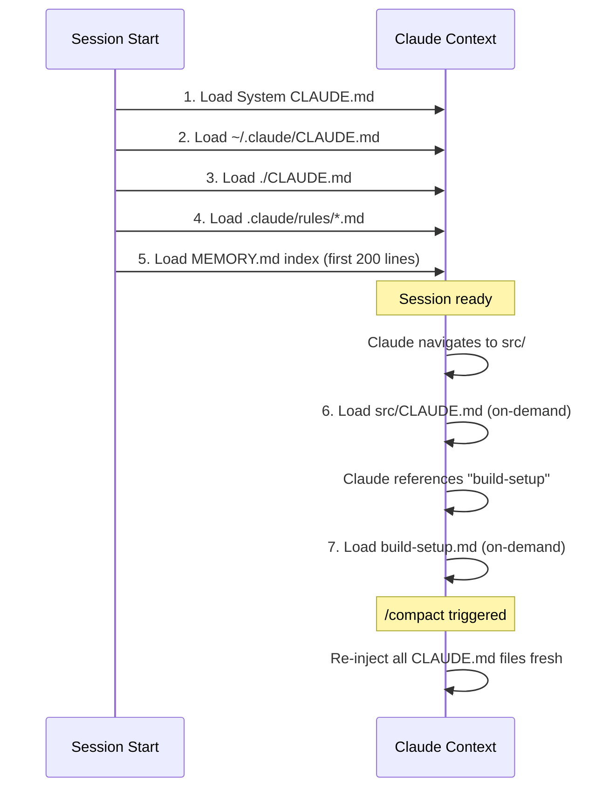

---

## CLI ရည်ညွှန်းချက်

### Session များ စတင်ခြင်း

```bash
claude                              # Interactive session
claude -p "prompt"                  # Non-interactive (prints and exits)
claude --permission-mode plan        # Read-only exploration
claude --model sonnet               # Specify model
claude --agent code-reviewer        # Use specific agent
claude -w feature-branch            # Start session in isolated git worktree
claude --add-dir ../shared-lib      # Add extra directories
claude --debug                      # Debug logging
claude --dangerously-skip-permissions  # Auto-accept all permissions (dangerous!)
claude -r                           # Resume last session (short for --resume)
claude -c                           # Select and resume a previous session (interactive picker)
```

### keyboard shortcut များ

| shortcut  | လုပ်ဆောင်ချက် |
|----------|--------|
| **Ctrl+C** | လက်ရှိထုတ်လုပ်နေခြင်းကို ပယ်ဖျက်ရန် |
| **Ctrl+D** | Session မှ ထွက်ရန် |
| **Ctrl+L** | မျက်နှာပြင်ကို ရှင်းလင်းရန် |
| **Ctrl+O** | အသေးစိတ်ထုတ်ပြန်မှုကို အဖွင့်အပိတ်လုပ်ရန် |
| **Ctrl+B** | လက်ရှိအလုပ်ကို move to background လုပ်ရန် |
| **Ctrl+T** | task list ကို အဖွင့်အပိတ်လုပ်ရန် |
| **Ctrl+R** | ရာဇဝင်ကို နောက်ပြန်ရှာဖွေရန် |
| **Ctrl+V** / **Cmd+V** | clipboard မှ ပုံကို ကူးထည့်ရန် |
| **Shift+Tab** | ခွင့်ပြုချက် mode များကို ပြောင်းလဲရန် |
| **Esc Esc** | မှတ်တိုင်သို့ နောက်ပြန်ဆုတ်ရန် |
| **/** | command menu ကို ဖွင့်ရန် |
| **@** | file ဖော်ပြချက် အလိုအလျောက်ဖြည့်သွင်းရန် |

### Image Support

Claude Code CLI တွင် image များကို အောက်ပါနည်းလမ်း (၃) ခုဖြင့် ထည့်သွင်းနိုင်သည်-

| နည်းလမ်း | အသုံးပြုပုံ |
|---------|-----------|
| **Clipboard paste** | `Ctrl+V` / `Cmd+V` နှိပ်ပါ — screenshot သို့မဟုတ် copied image တိုက်ရိုက် paste လုပ်နိုင်သည် |
| **Drag & drop** | Image file ကို terminal ထဲသို့ drag လုပ်ချပါ |
| **`@` reference** | `@path/to/image.png` ဟု ရိုက်ထည့်ပါ — local image file ကို context ထဲ ထည့်သွင်းသည် |

```bash
# CLI pipe မှတဆင့် image path ပေးပို့ခြင်း
echo "describe this diagram" | claude --image ./diagram.png

# @ ဖြင့် reference လုပ်ခြင်း (interactive session ထဲမှာ)
> @screenshots/error.png what is wrong here?
```

> **Note:** PNG, JPG, GIF, WebP format များကို support လုပ်သည်။

---

### ပါဝင်ပြီးသား Command များ

| Command | ရည်ရွယ်ချက် |
|---------|---------|
| `/help` | အကူအညီပြသရန် |
| `/compact` | context ကို လွတ်စေရန် ဆွေးနွေးမှုကို အကျဉ်းချုံးရန် |
| `/memory` | CLAUDE.md နှင့် အလိုအလျောက် memory ကို ကြည့်ရန်/တည်းဖြတ်ရန် |
| `/config` | configuration အင်တာဖေ့စ် |
| `/hooks` | ဖွဲ့စည်းထားသော hooks များကို ကြည့်ရန် |
| `/mcp` | MCP Serverများကို စီမံခန့်ခွဲရန် |
| `/agents` |  Agents ဖန်တီးရန်/စီမံခန့်ခွဲရန် |
| `/cost` | တိုကင်အသုံးပြုမှုနှင့် ကုန်ကျစရိတ် |
| `/resume` | ယခင်Session ကို ပြန်လည်စတင်ရန် |
| `/clear` | Session အသစ် |
| `/rewind` | မှတ်တိုင်သို့ ပြန်လည်ထားရှိရန် |
| `/vim` | vim editor mode ကို ဖွင့်ရန် |
| `/theme` | terminal theme ကို ပြောင်းရန် |

### Bash mode 

Shell ထဲမှာ command တစ်ခုခုကို တိုက်ရိုက် run ပြီး၊ ထွက်လာတဲ့ ရလဒ် (output) ကိုပါ context ထဲ တစ်ခါတည်း ထည့်ချင်ရင် command ရဲ့ ရှေ့ဆုံးမှာ `!` လေး တပ်ပေးရုံပါပဲ။ ဥပမာ -

```
! npm test
! git status
! curl https://api.example.com/health
```

### pipeline ချိတ်ဆက်ခြင်း

```bash
echo "explain this" | claude
cat error.log | claude -p "diagnose this error"
git diff | claude -p "review these changes"
claude -p "generate types" > types.ts
```

---

## IDE ပေါင်းစပ်မှုများ

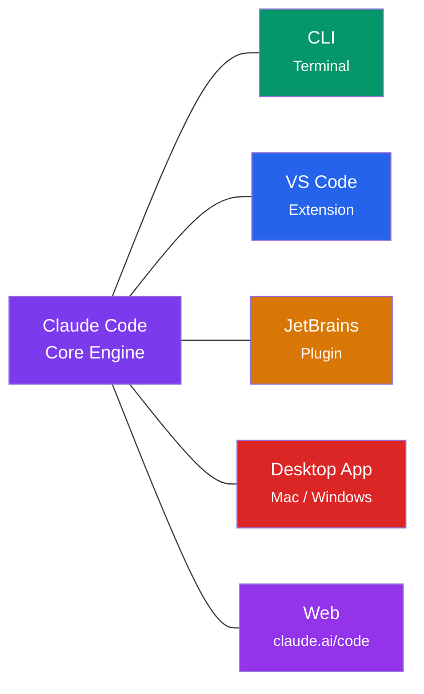

### VS Code

**ဘယ်လို သွင်းရမလဲဆိုရင်-** Extensions panel (Cmd+Shift+X) ကိုဖွင့်ပြီး "Claude Code" ကို ရှာလိုက်ပါ။

**အဓိက လုပ်ဆောင်ချက်များ:**
- မူလ graphical panel
- လက်ခံ/ငြင်းပယ် ဖြင့် အပြောင်းအလဲများကို ကြည့်ရှုခြင်း
- လိုင်းအပိုင်းအခြားများဖြင့် @-file ဖော်ပြခြင်း
- markdown ပြန်လည်သုံးသပ်မှုဖြင့် အစီအစဉ်ဆွဲသည့် mode 
- tab များစွာဖြင့် ဆွေးနွေးမှုများ
- claude.ai မှ အဝေးရောက် Session များကို ပြန်လည်စတင်ခြင်း

**shortcut များ:**
| shortcut  | လုပ်ဆောင်ချက် |
|----------|--------|
| **Cmd+Esc** / **Ctrl+Esc** | အာရုံစိုက်မှုကို ပြောင်းလဲရန် (editor / Claude) |
| **Cmd+Shift+Esc** | ဆွေးနွေးမှု tab အသစ် |
| **Option+K** / **Alt+K** | ရွေးချယ်မှုဖြင့် @-ဖော်ပြချက်ကို ထည့်သွင်းရန် |

### JetBrains (IntelliJ, PyCharm, WebStorm, etc.)

**ထည့်သွင်းရန်:** Settings > Plugins > Marketplace > search "Claude Code"။

**အဓိက လုပ်ဆောင်ချက်များ:**
- အမြန်စတင်ရန်: Cmd+Esc (Mac) / Ctrl+Esc (Windows/Linux)
- IDE diff viewer ပေါင်းစပ်မှု
- ရွေးချယ်ထားသော ဆက်စပ်အကြောင်းအရာ မျှဝေခြင်း
- file ရည်ညွှန်းချက်: Cmd+Option+K / Alt+Ctrl+K

**Remote Development လုပ်မယ့်သူတွေ အထူးသတိပြုရန်-** Plugin ကို ကိုယ့်စက် (local client) ပေါ်မှာ မဟုတ်ဘဲ **Remote Host** (အဝေးက စက်) ပေါ်မှာ တိုက်ရိုက် install လုပ်ပေးရပါမယ်။

---

## Project Structure

သေသေချာချာ စနစ်တကျ ပြင်ဆင်ထားတဲ့ Claude Code Project တစ်ခုရဲ့ ပုံစံမျိုးက ဒီလိုလေး ဖြစ်လာမှာပါ။ လေ့လာကြည့်လိုက်ပါဦး-

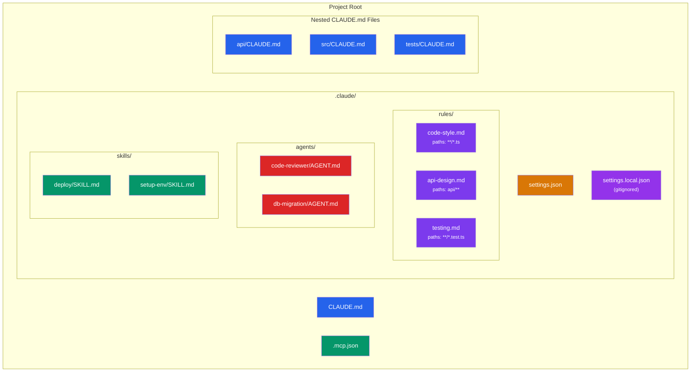

### Folder Structure

```
your-project/
  CLAUDE.md                          # Project-wide instructions
  .mcp.json                          # MCP server connections
  api/
    CLAUDE.md                        # API-specific rules
  src/
    CLAUDE.md                        # Source code conventions
  tests/
    CLAUDE.md                        # Testing patterns
  .claude/
    settings.json                    # Project settings & hooks
    settings.local.json              # Personal overrides (gitignored)
    rules/
      code-style.md                  # Scoped to *.ts files
      api-design.md                  # Scoped to api/**
      testing.md                     # Scoped to **/*.test.ts
    agents/
      code-reviewer/AGENT.md         # Custom review agent
      db-migration/AGENT.md          # Database migration specialist
    skills/
      deploy/SKILL.md                # Deploy skill
      setup-env/SKILL.md             # Environment setup skill
```

### Quick Start

တကယ်လို့ ကိုယ်က အများကြီး ရှုပ်ရှုပ်ယှက်ယှက် မလုပ်ချင်ဘူး၊ မရှိမဖြစ် လိုအပ်တာလေးတွေလောက်ပဲ အဓိက သုံးချင်တယ်ဆိုရင်တော့ အောက်မှာပြထားသလို file တစ်ခုတည်း ဖန်တီးလိုက်ရုံနဲ့ အဆင်ပြေပါတယ်။

**CLAUDE.md:**
```markdown
# Project: My App

## Stack
TypeScript, React, Node.js, PostgreSQL

## Commands
- `npm run dev` - start dev server
- `npm test` - run tests
- `npm run lint` - lint code

## Rules
- Use functional components with hooks
- All API routes need input validation with zod
- Write tests for new features
```

ဒီလောက်ဆို အိုကေသွားပါပြီ။ Claude Code က session အသစ်စတိုင်းမှာ ဒီ file လေးကို အမြဲတမ်း ပြန်ဖတ်ပြီး ကိုယ်သတ်မှတ်ထားတဲ့ စည်းမျဉ်းတွေအတိုင်း သေချာလိုက်နာပေးသွားမှာ ဖြစ်ပါတယ်။ အားလုံးလည်း အဆင်ပြေကြမယ်လို့ မျှော်လင့်ပါတယ်။

---

## နောက်ထပ် ဖတ်ရှုရန်

- **တရားဝင် မှတ်တမ်းများ:** [code.claude.com/docs](https://code.claude.com/docs)
- **ပြဿနာများကို သတင်းပို့ရန်:** [github.com/anthropics/claude-code/issues](https://github.com/anthropics/claude-code/issues)
- **အက်ပ်တွင်း အကူအညီ:** မည်သည့် Claude Code Session တွင်မဆို `/help` ဟု ရိုက်ထည့်ပါ