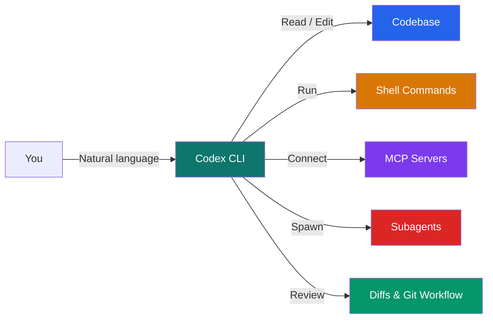
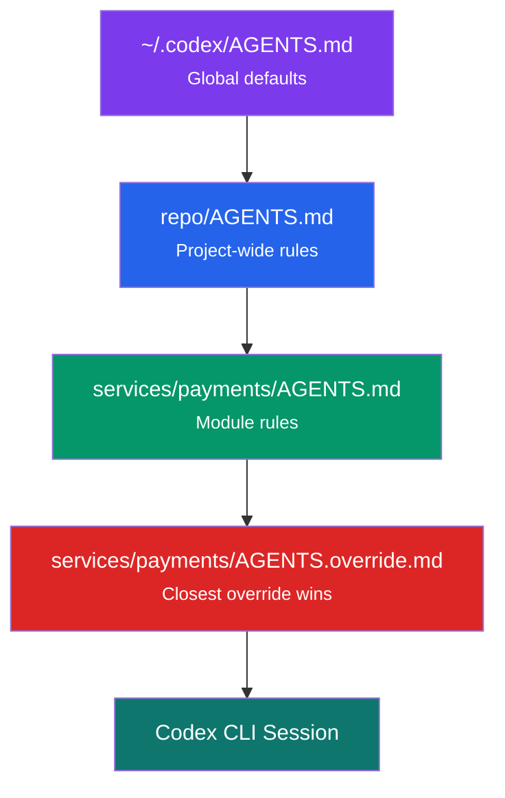
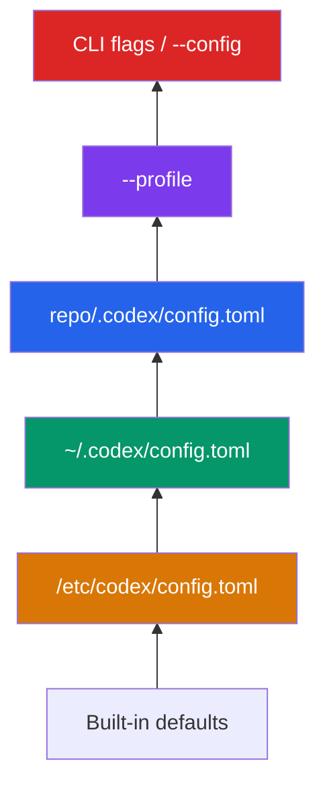
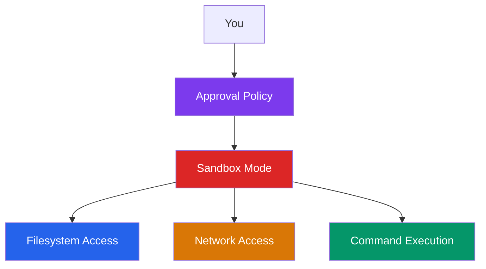
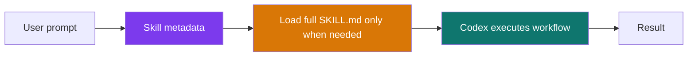
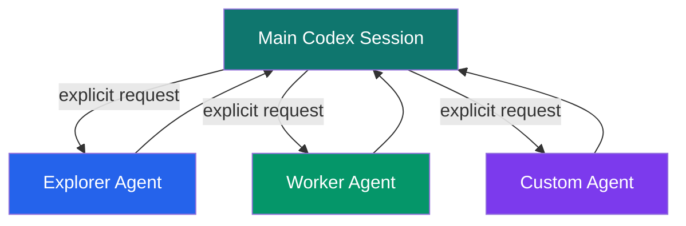
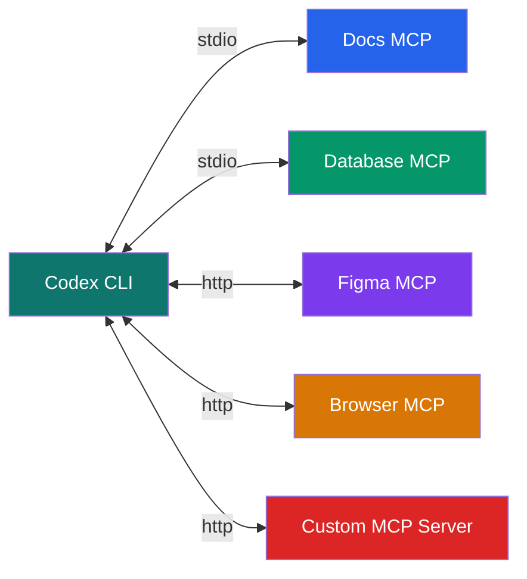
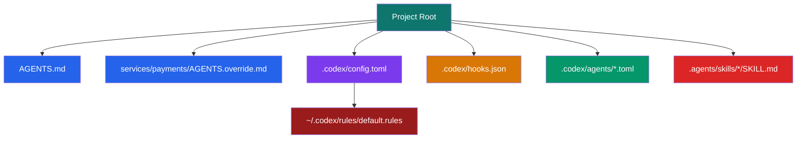

# Codex CLI Guide

## မာတိကာ

- [Codex CLI ဆိုတာ ဘာလဲ?](#codex-cli-ဆိုတာ-ဘာလဲ)
- [စတင်ခြင်း](#စတင်ခြင်း)
- [Authentication - Login နှင့် Access](#authentication---login-နှင့်-access)
- [AGENTS.md - ပရောဂျက် ညွှန်ကြားချက်များ](#agentsmd---ပရောဂျက်-ညွှန်ကြားချက်များ)
- [Settings နှင့် Configuration](#settings-နှင့်-configuration)
- [Sandbox, Approval, Network နှင့် Rules](#sandbox-approval-network-နှင့်-rules)
- [Skills နှင့် Slash Commands](#skills-နှင့်-slash-commands)
- [Agents နှင့် Subagents](#agents-နှင့်-subagents)
- [MCP (Model Context Protocol)](#mcp-model-context-protocol)
- [Hooks - Lifecycle အလိုအလျောက်လုပ်ဆောင်ခြင်း](#hooks---lifecycle-အလိုအလျောက်လုပ်ဆောင်ခြင်း)
- [Non-interactive Mode နှင့် Automation](#non-interactive-mode-နှင့်-automation)
- [Session History, Resume နှင့် Local State](#session-history-resume-နှင့်-local-state)
- [CLI ရည်ညွှန်းချက်](#cli-ရည်ညွှန်းချက်)
- [Project Structure](#project-structure)
- [နောက်ထပ် ဖတ်ရှုရန်](#နောက်ထပ်-ဖတ်ရှုရန်)

---

## Codex CLI ဆိုတာ ဘာလဲ?

Codex CLI ဆိုတာ OpenAI ရဲ့ coding agent ကို terminal ထဲကနေ တိုက်ရိုက် အသုံးပြုနိုင်စေတဲ့ command-line client ဖြစ်ပါတယ်။ အလွယ်ပြောရရင် သူက chat bot တစ်ခုထက် ပိုပါတယ်။ Repository ကို ဖတ်နိုင်တယ်၊ file တွေကို ပြင်နိုင်တယ်၊ terminal command တွေ run နိုင်တယ်၊ MCP tools တွေနဲ့ ချိတ်ဆက်နိုင်တယ်၊ လိုအပ်ရင် subagent တွေ spawn လုပ်ပြီး အပြိုင်အလုပ်လုပ်စေနိုင်တယ်။



**ဘယ်နေရာမှာ အဓိက သုံးလဲဆိုရင်တော့-**
- local terminal ထဲမှာ codebase ကို နားလည်စေချင်တဲ့အခါ
- repo အပေါ်မှာ implementation, review, debugging လုပ်ခိုင်းချင်တဲ့အခါ
- `codex exec` နဲ့ CI/CD, scripts, automation flow ထဲ ထည့်သုံးချင်တဲ့အခါ
- `AGENTS.md`, skills, MCP, subagents တွေပါ တစ်ပြိုင်နက် အသုံးချချင်တဲ့အခါ

---

## စတင်ခြင်း

Codex CLI ကို official docs အရ npm နဲ့ install လုပ်တာက အလွယ်ဆုံးပါ။

```bash
# Install
npm i -g @openai/codex

# Start interactive terminal UI
codex

# Quick one-off prompt
codex "Explain this codebase"

# Use a specific model
codex --model gpt-5.4

# Low-friction local automation
codex --full-auto "Fix the failing tests"

# Upgrade to the latest CLI
npm i -g @openai/codex@latest
```

**မှတ်ထားသင့်တဲ့ အချက်တွေ**
- ပထမဆုံး `codex` run လုပ်တဲ့အခါ login ဝင်ခိုင်းပါလိမ့်မယ်။
- Official docs အရ Codex CLI ကို macOS နဲ့ Linux မှာ အပြည့်အဝ ပိုကောင်းစွာ သုံးနိုင်ပါတယ်။
- Windows support က experimental အနေအထားပါ။ Windows သုံးမယ်ဆို WSL ထဲမှာ run တာ ပိုကောင်းပါတယ်။

---

## Authentication - Login နှင့် Access

Codex CLI မှာ OpenAI models သုံးဖို့ login နည်း (၂) မျိုးရှိပါတယ်။

- **ChatGPT sign-in**: subscription / workspace access နဲ့ သုံးတာ
- **API key sign-in**: usage-based billing နဲ့ သုံးတာ

Official docs အရ Codex CLI နဲ့ IDE extension က ဒီ login method နှစ်မျိုးစလုံးကို support လုပ်ပါတယ်။

### အလွယ်ဆုံး login နည်းများ

```bash
# Browser login flow
codex login

# API key from stdin
printenv OPENAI_API_KEY | codex login --with-api-key

# Check current login state
codex login status

# Headless / remote environment
codex login --device-auth
```

### ChatGPT login နဲ့ API key login ကွာခြားချက်

| နည်းလမ်း | ဘာအတွက် သင့်တော်လဲ |
|---------|-------------------|
| **ChatGPT login** | ပုံမှန် local development, Codex credits / workspace policies, Fast mode လို feature မျိုးတွေ |
| **API key login** | CI/CD, script automation, usage-based billing, headless workflows |

### သိထားသင့်တဲ့ အချက်များ

- ChatGPT login လုပ်ရင် browser window တစ်ခု ဖွင့်ပြီး OAuth flow နဲ့ sign in လုပ်ပါတယ်။
- API key login လုပ်ရင် OpenAI Platform usage အတိုင်း billing လုပ်သွားမှာပါ။
- Cached credential တွေကို `~/.codex/auth.json` သို့မဟုတ် OS keychain ထဲမှာ သိမ်းထားနိုင်ပါတယ်။
- Remote/headless machine တွေအတွက် device auth (`codex login --device-auth`) ကို official docs က recommend လုပ်ထားပါတယ်။

---

## AGENTS.md - ပရောဂျက် ညွှန်ကြားချက်များ

Claude Code မှာ `CLAUDE.md` ရှိသလို Codex CLI မှာတော့ **`AGENTS.md`** က project instruction file အဓိက ဖြစ်ပါတယ်။ Codex က အလုပ်မစခင် `AGENTS.md` ကို ဖတ်ပြီး အဲဒီ project ရဲ့ working agreements, build command, coding rules, testing rules, architecture notes တွေကို context ထဲ ထည့်သွားပါတယ်။



### Codex က AGENTS.md ကို ဘယ်လိုရှာလဲ?

Official docs အရ discovery order က ဒီလိုပါ-

1. `~/.codex/AGENTS.override.md` ရှိရင် အဲဒါကို သုံးတယ်
2. မရှိရင် `~/.codex/AGENTS.md` ကို သုံးတယ်
3. Project root ကနေ current working directory အထိ directory တစ်ခုချင်းစီမှာ `AGENTS.override.md` ကို အရင်ရှာတယ်
4. မရှိရင် `AGENTS.md` ကိုရှာတယ်
5. မရှိသေးရင် `project_doc_fallback_filenames` ထဲက alternate filename တွေကို စစ်တယ်
6. Root ကနေ current directory အထိ ရလာတဲ့ instruction file တွေကို ပေါင်းစည်းပြီး later file က earlier guidance ကို override ဖြစ်စေတယ်

### အဓိက အချက်များ

- Directory တစ်ခုချင်းစီမှာ file **တစ်ခုတည်း** ပဲ ယူပါတယ်
- `AGENTS.override.md` က `AGENTS.md` ထက် ဦးစားပေးပါတယ်
- Combined instruction size က default **32 KiB** ထိပဲ load လုပ်ပါတယ်
- Project ကို **trusted** မထားရင် `.codex/config.toml` လို project layer တွေအပြင် instruction discovery ပိုင်းလည်း ကန့်သတ်နိုင်ပါတယ်

### Global AGENTS.md

```bash
mkdir -p ~/.codex
```

```markdown
# ~/.codex/AGENTS.md

## Working agreements

- Always run tests after code changes
- Prefer pnpm over npm when both exist
- Ask before adding new production dependencies
```

### Repo-level AGENTS.md

```markdown
# AGENTS.md

## Repository expectations

- Run `npm run lint` before opening a pull request
- Update docs when public behavior changes
- Prefer existing utilities over adding new helper files
```

### Nested override example

```markdown
# services/payments/AGENTS.override.md

## Payments rules

- Use `make test-payments` instead of generic test commands
- Never change payment credentials without calling it out clearly
```

### `/init` နဲ့ scaffold လုပ်ခြင်း

Codex CLI ထဲမှာ `/init` command သုံးပြီး current directory အတွက် `AGENTS.md` scaffold တစ်ခု အလိုအလျောက် generate လုပ်လို့ရပါတယ်။

```text
/init
```

### Alternate filename သုံးချင်ရင်

```toml
# ~/.codex/config.toml
project_doc_fallback_filenames = ["TEAM_GUIDE.md", ".agents.md"]
project_doc_max_bytes = 65536
```

---

## Settings နှင့် Configuration

Codex CLI ရဲ့ main config file က `config.toml` ဖြစ်ပါတယ်။

- User-level config: `~/.codex/config.toml`
- Project-level config: `<repo>/.codex/config.toml`
- System-level config: `/etc/codex/config.toml`

### Configuration precedence

Official docs အရ precedence order က ဒီလိုပါ-

1. CLI flags နဲ့ `--config`
2. `--profile <name>` နဲ့ရွေးထားတဲ့ profile
3. Project `.codex/config.toml` layers (root ကနေ current dir ထိ, closest wins)
4. User config `~/.codex/config.toml`
5. System config `/etc/codex/config.toml`
6. Built-in defaults



### Common config options

```toml
model = "gpt-5.4"
approval_policy = "on-request"
sandbox_mode = "workspace-write"
web_search = "cached"
model_reasoning_effort = "high"
personality = "friendly"

[sandbox_workspace_write]
network_access = false

[shell_environment_policy]
include_only = ["PATH", "HOME"]
```

### မကြာခဏပြောင်းလေ့ရှိတဲ့ key များ

| key | ရည်ရွယ်ချက် |
|-----|------------|
| `model` | Default model သတ်မှတ်ရန် |
| `approval_policy` | command run မလုပ်ခင် prompt မေး/မမေး ထိန်းချုပ်ရန် |
| `sandbox_mode` | filesystem / network access scope ထိန်းချုပ်ရန် |
| `web_search` | cached / live / disabled search mode |
| `model_reasoning_effort` | reasoning depth ကို `minimal` မှ `xhigh` ထိ သတ်မှတ်ရန် |
| `personality` | `friendly`, `pragmatic`, `none` style |
| `review_model` | `/review` အတွက် model override |

### CLI ကနေ one-off override

```bash
codex --model gpt-5.4
codex --config model='"gpt-5.4"'
codex --config sandbox_workspace_write.network_access=true
codex --config 'shell_environment_policy.include_only=["PATH","HOME"]'
```

### Profiles

Profiles က named preset တစ်ခုလို သုံးလို့ရပါတယ်။ Official docs အရ experimental ဖြစ်ပြီး CLI မှာသာ အဓိက support လုပ်ထားပါတယ်။

```toml
model = "gpt-5-codex"
approval_policy = "on-request"

[profiles.deep-review]
model = "gpt-5-pro"
model_reasoning_effort = "high"
approval_policy = "never"

[profiles.lightweight]
model = "gpt-4.1"
approval_policy = "untrusted"
```

```bash
codex --profile deep-review
```

### CODEX_HOME

Codex ရဲ့ local state ကို default အနေဖြင့် `~/.codex` အောက်မှာ သိမ်းထားပါတယ်။ `CODEX_HOME` သတ်မှတ်ထားရင် အဲဒီ path ကို သုံးသွားမှာပါ။

---

## Sandbox, Approval, Network နှင့် Rules

Codex CLI ကို လုံခြုံစွာ သုံးဖို့ဆိုရင် sandbox mode နဲ့ approval policy ကို နားလည်ထားဖို့ အရေးကြီးပါတယ်။ Official docs အရ local Codex run တွေမှာ **network access က default အနေဖြင့် off** ဖြစ်ပြီး၊ write access ကိုလည်း active workspace ထဲမှာပဲ ကန့်သတ်ထားပါတယ်။



### Sandbox mode များ

| mode | အဓိပ္ပာယ် |
|------|-----------|
| `read-only` | file မပြင်နိုင်၊ command run scope က အလွန်ကန့်သတ်ထား |
| `workspace-write` | workspace ထဲမှာ read/edit/run လုပ်နိုင်၊ default local mode အဖြစ် အများဆုံးသုံးတဲ့ mode |
| `danger-full-access` | machine ပေါ်က အခြားနေရာတွေထိ သွားနိုင်၊ network access လည်း ဖွင့်နိုင် |

### Approval policy များ

| policy | အဓိပ္ပာယ် |
|--------|-----------|
| `untrusted` | trusted command မဟုတ်ရင် approval တောင်းမယ် |
| `on-request` | model က လိုအပ်တဲ့အချိန် approval တောင်းမယ် |
| `never` | approval မတောင်းဘဲ failure ဖြစ်ရင် model ကိုပြန်ပေးမယ် |
| `on-failure` | deprecated ဖြစ်ပါပြီ |

### အသုံးများတဲ့ flag များ

```bash
# Ask before risky actions, write only in workspace
codex --full-auto

# Explicit control
codex --sandbox workspace-write --ask-for-approval on-request

# Read-only consultation
codex --sandbox read-only --ask-for-approval untrusted

# Extremely dangerous
codex --dangerously-bypass-approvals-and-sandbox
```

### Interactive session ထဲမှာ

Official docs အရ `/permissions` နဲ့ approval mode ကို mid-session ပြောင်းလို့ရပါတယ်။

- **Auto**: workspace ထဲမှာ file read/edit/run လုပ်နိုင်
- **Read-only**: consultative mode, plan-only style ပိုနီးစပ်
- **Full Access**: network အပါအဝင် machine scope ပိုကျယ်

### Network access

`workspace-write` mode မှာ network access ကို config နဲ့ သီးသန့်ဖွင့်နိုင်ပါတယ်-

```toml
[sandbox_workspace_write]
network_access = true
```

### Web search

Official docs အရ local Codex CLI မှာ web search ကို default အနေဖြင့် **cached** mode နဲ့ သုံးနိုင်ပါတယ်။

```toml
web_search = "cached"   # default
# web_search = "live"   # same as --search
# web_search = "disabled"
```

```bash
# Use live web search for a run
codex --search "Find the latest breaking changes in this library"
```

### Rules - outside sandbox command control

Codex မှာ experimental **rules** system လည်း ရှိပါတယ်။ ဒီကောင်က sandbox အပြင်ကို ထွက်သွားမယ့် command prefix တွေကို allow / prompt / forbidden လုပ်ဖို့ သုံးတာပါ။

User-level rule file example:

```python
# ~/.codex/rules/default.rules
prefix_rule(
    pattern = ["gh", "pr", "view"],
    decision = "prompt",
    justification = "Viewing PRs is allowed with approval",
    match = [
        "gh pr view 7888",
        "gh pr view --repo openai/codex",
    ],
)
```

Rule file ကို test လုပ်ချင်ရင်-

```bash
codex execpolicy check --pretty \
  --rules ~/.codex/rules/default.rules \
  -- gh pr view 7888 --json title,body,comments
```

---

## Skills နှင့် Slash Commands

Codex CLI ရဲ့ customization ပိုင်းမှာ `skills` နဲ့ `slash commands` နှစ်မျိုးစလုံး အရေးကြီးပါတယ်။

### Skills ဆိုတာဘာလဲ?

Skill ဆိုတာ task-specific workflow တစ်ခုကို instructions, references, scripts တွေနဲ့ ထုပ်ပိုးထားတဲ့ reusable capability ဖြစ်ပါတယ်။



### Skill structure

```text
my-skill/
  SKILL.md
  scripts/
  references/
  assets/
  agents/
    openai.yaml
```

### SKILL.md example

```yaml
---
name: release-notes
description: Generate release notes when the user asks to summarize recent changes for a release.
---

1. Inspect the recent commits
2. Group changes by feature / fix / docs
3. Produce concise release notes
```

### Skill invocation နည်း

Official docs အရ skill ကို (၂) နည်းနဲ့ activate လုပ်နိုင်ပါတယ်-

1. **Explicit**: `/skills` သို့မဟုတ် `$skill-name` mention နဲ့
2. **Implicit**: prompt က skill description နဲ့ ကိုက်ညီရင် Codex က auto သုံးနိုင်တယ်

### Skill locations

| scope | location |
|------|----------|
| Repo | `.agents/skills` |
| User | `$HOME/.agents/skills` |
| Admin | `/etc/codex/skills` |
| System | Codex built-in skills |

Repo အတွင်းက `.agents/skills` folder တွေကို Codex က current directory ကနေ repo root အထိ scan လုပ်ပါတယ်။

### Skill tools

```text
$skill-creator
$skill-installer linear
```

### Slash commands

Codex CLI မှာ `/` ရိုက်လိုက်တာနဲ့ slash command picker ဖွင့်နိုင်ပါတယ်။ Official docs အရ keyboard-first control အတွက် ဒီ commands တွေက အလွန်အသုံးဝင်ပါတယ်။

| Command | လုပ်ဆောင်ချက် |
|---------|---------------|
| `/permissions` | approval / access level ပြောင်းရန် |
| `/agent` | active agent thread ပြောင်းရန် |
| `/apps` | connector/app mention ထည့်ရန် |
| `/clear` | terminal နဲ့ conversation ကို fresh start လုပ်ရန် |
| `/compact` | long conversation ကို summarize လုပ်ရန် |
| `/copy` | latest completed output ကို copy လုပ်ရန် |
| `/diff` | Git diff ကိုကြည့်ရန် |
| `/init` | `AGENTS.md` scaffold generate လုပ်ရန် |
| `/mcp` | active MCP tools list ကြည့်ရန် |
| `/mention` | file/folder mention ထည့်ရန် |
| `/model` | model နှင့် reasoning effort ပြောင်းရန် |
| `/fast` | GPT-5.4 Fast mode toggle လုပ်ရန် |
| `/plan` | plan mode ထဲ ပြောင်းရန် |
| `/personality` | communication style ပြောင်းရန် |
| `/ps` | background terminal status ကြည့်ရန် |
| `/fork` | current conversation ကို fork လုပ်ရန် |
| `/resume` | saved session ပြန်ဖွင့်ရန် |
| `/new` | same CLI session ထဲ chat အသစ်စရန် |
| `/review` | working tree review လုပ်ရန် |
| `/status` | current model, approvals, token usage ကြည့်ရန် |
| `/debug-config` | config layer diagnostics ကြည့်ရန် |
| `/logout` | sign out လုပ်ရန် |

### အသုံးဝင်တဲ့ workflow များ

```text
/plan Propose a migration plan for this service
/review
/diff
/mcp
/status
/fork
```

### Image inputs

Codex CLI က image input လည်း support လုပ်ပါတယ်။

```bash
codex -i screenshot.png "Explain this UI bug"
codex --image img1.png,img2.jpg "Summarize these diagrams"
```

### Prompt editor

Long prompt ရေးရတာခက်ရင် input field ထဲမှာ **Ctrl+G** နှိပ်ပြီး `VISUAL` သို့မဟုတ် `EDITOR` နဲ့ သတ်မှတ်ထားတဲ့ editor ကို ဖွင့်လို့ရပါတယ်။

---

## Agents နှင့် Subagents

Codex က subagent workflow ကို support လုပ်ပါတယ်။ ဒါပေမယ့် official docs အရ Codex က **user က explicit ပြောမှပဲ** subagent spawn လုပ်ပါတယ်။ Claude လို auto fan-out လုပ်သွားတာမျိုး default မဟုတ်ပါဘူး။



### Built-in agent types

| agent | ရည်ရွယ်ချက် |
|------|-------------|
| `default` | general-purpose fallback |
| `worker` | implementation, edits, fixes |
| `explorer` | read-heavy exploration |

### Custom agents

Custom agent file တွေကို ဒီနေရာတွေမှာထားနိုင်ပါတယ်-

```text
~/.codex/agents/*.toml      # Personal agents
.codex/agents/*.toml        # Project-scoped agents
```

### Custom agent example

```toml
name = "reviewer"
description = "PR reviewer focused on correctness, security, and missing tests."
model = "gpt-5.4"
model_reasoning_effort = "high"
sandbox_mode = "read-only"
developer_instructions = """
Review code like an owner.
Prioritize correctness, security, behavior regressions, and missing test coverage.
"""
```

### `[agents]` global settings

```toml
[agents]
max_threads = 6
max_depth = 1
job_max_runtime_seconds = 1800
```

### သိထားသင့်တဲ့ အချက်များ

- Default `max_threads` က 6 ဖြစ်ပါတယ်
- Default `max_depth` က 1 ဖြစ်ပြီး direct child agent ထိပဲ ခွင့်ပြုတာနဲ့ ဆင်တူပါတယ်
- Subagent workflow က token ပိုကုန်တယ်
- `/agent` command နဲ့ active agent thread တွေကြား switch လုပ်နိုင်တယ်

---

## MCP (Model Context Protocol)

MCP ကတော့ Codex ကို third-party tools, docs, browser tooling, design tools, databases, internal systems တွေနဲ့ ချိတ်ပေးတဲ့ protocol ဖြစ်ပါတယ်။



### Supported transport များ

Official docs အရ Codex က support လုပ်တာ-

- **STDIO servers**
- **Streamable HTTP servers**
- Bearer token auth
- OAuth auth (`codex mcp login <server-name>`)

### CLI နဲ့ MCP add လုပ်ခြင်း

```bash
codex mcp add context7 -- npx -y @upstash/context7-mcp
codex mcp list
codex mcp get context7
codex mcp remove context7
codex mcp login some-server
```

### `config.toml` နဲ့ configure လုပ်ခြင်း

```toml
[mcp_servers.context7]
command = "npx"
args = ["-y", "@upstash/context7-mcp"]
```

```toml
[mcp_servers.design]
url = "https://example.com/mcp"
bearer_token_env_var = "DESIGN_TOKEN"
```

### Key fields

| transport | fields |
|----------|--------|
| STDIO | `command`, `args`, `env`, `env_vars`, `cwd` |
| HTTP | `url`, `bearer_token_env_var`, `http_headers`, `env_http_headers` |

### TUI ထဲမှာ

```text
/mcp
```

ဒီ command နဲ့ active MCP tools တွေကို interactive session ထဲကနေ တိုက်ရိုက် ကြည့်လို့ရပါတယ်။

---

## Hooks - Lifecycle အလိုအလျောက်လုပ်ဆောင်ခြင်း

Codex hooks က lifecycle event တချို့ပေါ်မှာ deterministic script တွေ run စေဖို့ သုံးတာပါ။ Official docs အရ ဒီ feature က **experimental** ဖြစ်ပြီး Windows support ကို ယာယီ disable လုပ်ထားပါတယ်။

### Hook use cases

- prompt / command log များကို analytics system ဆီပို့ခြင်း
- API key paste လုပ်မိတာမျိုးကို block လုပ်ခြင်း
- stop event မှာ custom validator run လုပ်ခြင်း
- conversation summary ကို persistent note အဖြစ် သိမ်းခြင်း

### Hook enable လုပ်ခြင်း

```toml
[features]
codex_hooks = true
```

### Hook files

```text
~/.codex/hooks.json
<repo>/.codex/hooks.json
```

Codex က matching hook file အားလုံးကို load လုပ်ပြီး run စေပါတယ်။ Higher precedence layer က lower layer ကို replace မလုပ်ပါဘူး။

### Hook events

| event | အဓိပ္ပာယ် |
|------|-----------|
| `SessionStart` | session စတင်ချိန် |
| `UserPromptSubmit` | prompt မစီမံခင် |
| `PreToolUse` | tool မ run ခင် |
| `PostToolUse` | tool run ပြီးနောက် |
| `Stop` | turn ပြီးဆုံးချိန် |

### Example `hooks.json`

```json
{
  "hooks": {
    "SessionStart": [
      {
        "matcher": "startup|resume",
        "hooks": [
          {
            "type": "command",
            "command": "python3 ~/.codex/hooks/session_start.py",
            "statusMessage": "Loading session notes"
          }
        ]
      }
    ],
    "PreToolUse": [
      {
        "matcher": "Bash",
        "hooks": [
          {
            "type": "command",
            "command": "/usr/bin/python3 .codex/hooks/pre_tool_use_policy.py",
            "statusMessage": "Checking Bash command"
          }
        ]
      }
    ]
  }
}
```

---

## Non-interactive Mode နှင့် Automation

Codex CLI ကို script, CI, batch workflow တွေထဲ ထည့်သုံးချင်ရင် `codex exec` က အဓိက command ဖြစ်ပါတယ်။

### Basic usage

```bash
codex exec "summarize the repository structure and list the top 5 risky areas"

codex exec "generate release notes for the last 10 commits" | tee release-notes.md

codex exec --ephemeral "triage this repository and suggest next steps"
```

### Default behavior

Official docs အရ `codex exec` က-

- progress ကို `stderr` မှာ stream လုပ်တယ်
- final agent message ကို `stdout` ထုတ်တယ်
- default အနေဖြင့် **read-only sandbox** နဲ့ run တယ်

### Permissions for automation

```bash
# Allow edits in automation
codex exec --full-auto "fix the CI failure"

# Broad access only in controlled environments
codex exec --sandbox danger-full-access "run the full release process"
```

### JSONL output

```bash
codex exec --json "summarize the repo structure" | jq
```

### Final message to file

```bash
codex exec "Extract project metadata" -o ./project-metadata.txt
```

### Structured output with JSON Schema

```bash
codex exec "Extract project metadata" \
  --output-schema ./schema.json \
  -o ./project-metadata.json
```

### CI/CD အတွက် API key

Official docs အရ `codex exec` မှာ one-off API key သုံးချင်ရင် `CODEX_API_KEY` ကိုသုံးနိုင်ပါတယ်။

```bash
CODEX_API_KEY=<api-key> codex exec --json "triage open bug reports"
```

### Local code review automation

```bash
codex review --uncommitted
codex review --base main
codex review --commit HEAD~1
codex review "Focus on performance regressions"
```

---

## Session History, Resume နှင့် Local State

Codex CLI မှာ Claude Code လို auto-memory system တစ်ခုကို user-facing အနေနဲ့ အလေးပေးပြထားတာ မဟုတ်ပေမယ့် **local session transcripts**, **resume workflow**, **shared config state** တွေတော့ ရှိပါတယ်။

### Resume command

```bash
codex resume
codex resume --last
codex resume --all
codex resume <SESSION_ID>
```

Official docs အရ-

- `codex resume` က recent interactive sessions picker ကို ဖွင့်တယ်
- `--last` က picker မဖွင့်ဘဲ latest session ကို တိုက်ရိုက် ဖွင့်တယ်
- `--all` က current working directory filter ကို ဖြုတ်တယ်
- Session ID ကို `/status`, picker, သို့မဟုတ် `~/.codex/sessions/` ကနေ ယူနိုင်တယ်

### Non-interactive resume

```bash
codex exec resume --last "Implement the plan"
codex exec resume <SESSION_ID> "Fix the race conditions you found"
```

### Local state locations

Codex docs အရ `CODEX_HOME` default က `~/.codex` ဖြစ်ပြီး common files တွေက-

```text
~/.codex/
  config.toml
  auth.json
  history.jsonl
  log/
  sessions/
  sqlite/
```

### Useful notes

- CLI နဲ့ IDE extension က config layers နဲ့ cached login ကို မျှဝေသုံးနိုင်တယ်
- `/compact` နဲ့ long conversation ကို summarize လုပ်ပြီး context လွတ်အောင် လုပ်နိုင်တယ်
- `/fork` နဲ့ current conversation ကို thread အသစ်တစ်ခုအဖြစ် ခွဲထုတ်နိုင်တယ်

---

## CLI ရည်ညွှန်းချက်

### Core commands

```bash
codex                                  # Interactive CLI
codex "Explain this codebase"          # Quick prompt
codex exec "fix the CI failure"        # Non-interactive automation
codex review --uncommitted             # Review local changes
codex login                            # Login flow
codex logout                           # Remove cached credentials
codex resume --last                    # Resume latest session
codex fork                             # Fork a previous session
codex mcp list                         # MCP server management
codex features list                    # Feature flags
codex completion zsh                   # Shell completion
codex --version                        # CLI version
codex --help                           # Top-level help
```

### Important global flags

| flag | ရည်ရွယ်ချက် |
|------|------------|
| `--model`, `-m` | model သတ်မှတ်ရန် |
| `--cd`, `-C` | working directory သတ်မှတ်ရန် |
| `--profile`, `-p` | named profile ရွေးရန် |
| `--sandbox`, `-s` | sandbox mode သတ်မှတ်ရန် |
| `--ask-for-approval`, `-a` | approval policy သတ်မှတ်ရန် |
| `--full-auto` | `on-request` + `workspace-write` shortcut |
| `--search` | live web search ဖွင့်ရန် |
| `--add-dir` | extra writable roots ထည့်ရန် |
| `--image`, `-i` | image input attach လုပ်ရန် |
| `--config`, `-c` | one-off config override |
| `--oss` | local OSS provider သုံးရန် |
| `--dangerously-bypass-approvals-and-sandbox` | sandbox/approval bypass, အလွန်အန္တရာယ်များ |

### `codex exec` options

```bash
codex exec --json "summarize the repo structure"
codex exec --ephemeral "temporary analysis"
codex exec -o result.txt "write the final answer to a file too"
codex exec --output-schema schema.json -o out.json "return structured JSON"
```

### Shell completion

```bash
codex completion zsh
```

`~/.zshrc` ထဲမှာ-

```bash
autoload -Uz compinit && compinit
eval "$(codex completion zsh)"
```

### Useful interactive shortcuts

| shortcut | လုပ်ဆောင်ချက် |
|----------|---------------|
| `Ctrl+L` | screen clear |
| `Ctrl+G` | prompt editor open |
| `Up` / `Down` | composer draft history navigate |

---

## Project Structure

Codex CLI project တစ်ခုကို စနစ်တကျ ပြင်ဆင်ထားမယ်ဆိုရင် structure က ဒီလိုမျိုး ဖြစ်လာနိုင်ပါတယ်။



### Folder structure example

```text
your-project/
  AGENTS.md
  services/
    payments/
      AGENTS.override.md
  .codex/
    config.toml
    hooks.json
    agents/
      reviewer.toml
      explorer.toml
  .agents/
    skills/
      release-notes/
        SKILL.md
        scripts/
        references/
```

### Minimal quick start

တကယ်လို့ အရမ်းမရှုပ်စေချင်ဘူးဆိုရင် file (၂) ခုလောက်နဲ့တင် စလို့ရပါတယ်။

**AGENTS.md**

```markdown
# Project: My App

## Stack
TypeScript, React, Node.js, PostgreSQL

## Commands
- `npm run dev` - start dev server
- `npm test` - run tests
- `npm run lint` - lint code

## Rules
- Use functional components
- Run tests after code changes
- Ask before adding new dependencies
```

**.codex/config.toml**

```toml
model = "gpt-5.4"
approval_policy = "on-request"
sandbox_mode = "workspace-write"
web_search = "cached"
personality = "friendly"
```

ဒီလောက်နဲ့တင် Codex CLI ကို လက်တွေ့ production-ish workflow တော်တော်များများမှာ အသုံးချလို့ရသွားပါပြီ။

---

## နောက်ထပ် ဖတ်ရှုရန်

- **Codex CLI overview:** [developers.openai.com/codex/cli](https://developers.openai.com/codex/cli)
- **Codex CLI features:** [developers.openai.com/codex/cli/features](https://developers.openai.com/codex/cli/features)
- **Command line options:** [developers.openai.com/codex/cli/reference](https://developers.openai.com/codex/cli/reference)
- **AGENTS.md guide:** [developers.openai.com/codex/guides/agents-md](https://developers.openai.com/codex/guides/agents-md)
- **Config basics:** [developers.openai.com/codex/config-basic](https://developers.openai.com/codex/config-basic)
- **Hooks:** [developers.openai.com/codex/hooks](https://developers.openai.com/codex/hooks)
- **MCP:** [developers.openai.com/codex/mcp](https://developers.openai.com/codex/mcp)
- **Skills:** [developers.openai.com/codex/skills](https://developers.openai.com/codex/skills)
- **Subagents:** [developers.openai.com/codex/subagents](https://developers.openai.com/codex/subagents)
- **Non-interactive mode:** [developers.openai.com/codex/noninteractive](https://developers.openai.com/codex/noninteractive)
