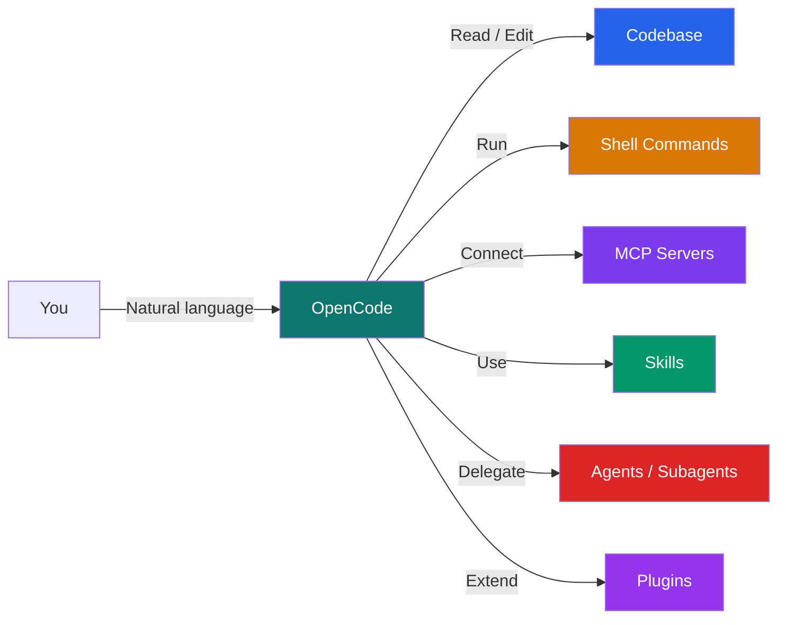
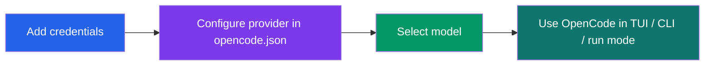
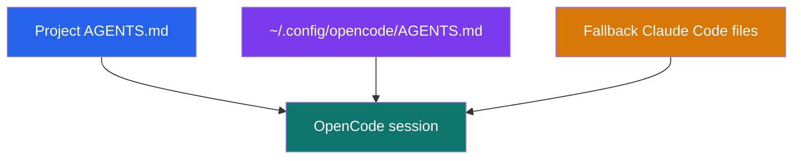
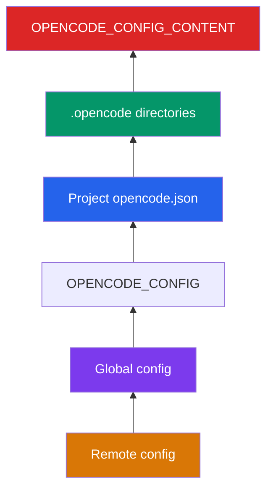
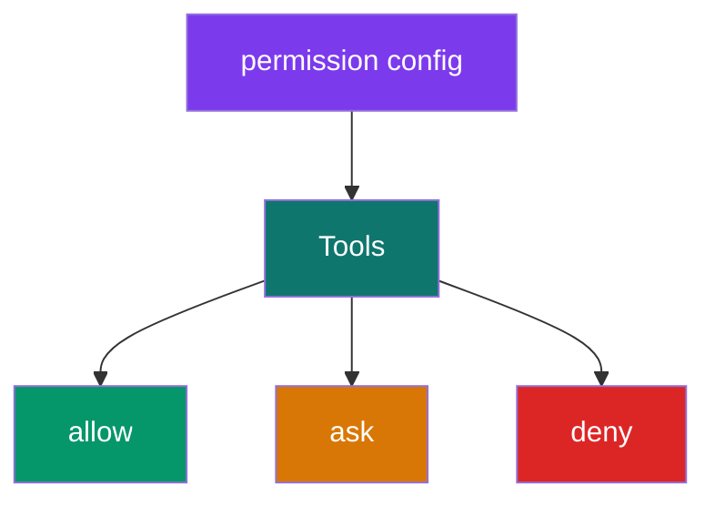
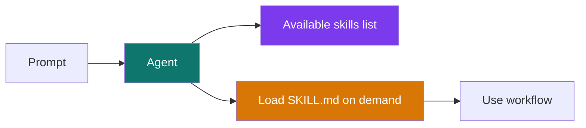
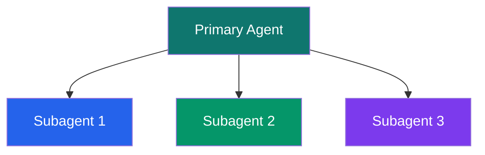
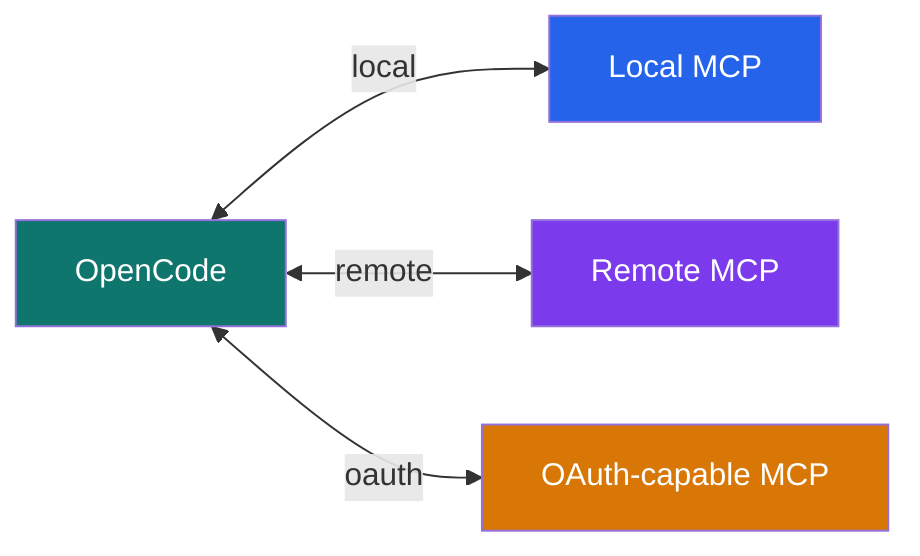
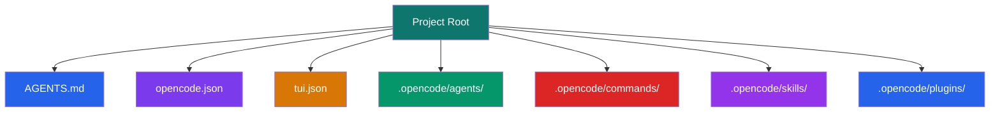

# OpenCode Guide

## မာတိကာ

- [OpenCode ဆိုတာ ဘာလဲ?](#opencode-ဆိုတာ-ဘာလဲ)
- [စတင်ခြင်း](#စတင်ခြင်း)
- [Providers နှင့် Authentication](#providers-နှင့်-authentication)
- [AGENTS.md - ပရောဂျက် ညွှန်ကြားချက်များ](#agentsmd---ပရောဂျက်-ညွှန်ကြားချက်များ)
- [Settings နှင့် Configuration](#settings-နှင့်-configuration)
- [Permissions, Tools နှင့် Network](#permissions-tools-နှင့်-network)
- [Skills, Custom Commands နှင့် Slash Commands](#skills-custom-commands-နှင့်-slash-commands)
- [Agents နှင့် Subagents](#agents-နှင့်-subagents)
- [MCP (Model Context Protocol)](#mcp-model-context-protocol)
- [Plugins နှင့် Formatters](#plugins-နှင့်-formatters)
- [Sessions, Share နှင့် Local State](#sessions-share-နှင့်-local-state)
- [CLI ရည်ညွှန်းချက်](#cli-ရည်ညွှန်းချက်)
- [Project Structure](#project-structure)
- [နောက်ထပ် ဖတ်ရှုရန်](#နောက်ထပ်-ဖတ်ရှုရန်)

---

## OpenCode ဆိုတာ ဘာလဲ?

OpenCode ဆိုတာ open source AI coding agent တစ်ခုဖြစ်ပြီး terminal ထဲမှာ အဓိက အသုံးပြုဖို့ design လုပ်ထားတာပါ။ Official docs အရ OpenCode ကို terminal-based TUI, desktop app, IDE extension အနေနဲ့ အသုံးပြုနိုင်ပါတယ်။ Repository ကိုဖတ်နိုင်တယ်၊ file ပြင်နိုင်တယ်၊ shell command run နိုင်တယ်၊ MCP tools တွေနဲ့ ချိတ်နိုင်တယ်၊ specialized agents နဲ့ skills တွေကိုပါ သုံးနိုင်ပါတယ်။



**OpenCode ရဲ့ ထူးခြားချက်အချို့**
- Open source ဖြစ်တယ်
- 75+ providers / models.dev ecosystem ကို support လုပ်တယ်
- local model တွေပါ သုံးနိုင်တယ်
- built-in permissions system ရှိတယ်
- MCP, skills, agents, plugins, custom commands တွေကို project level / global level နှစ်မျိုးစလုံး support လုပ်တယ်
- session sharing နဲ့ web/headless mode ပါ ရှိတယ်

---

## စတင်ခြင်း

Official docs အရ OpenCode ကို install လုပ်ဖို့ နည်းလမ်းအများကြီး ရှိပါတယ်။

```bash
# Recommended install script
curl -fsSL https://opencode.ai/install | bash

# npm
npm install -g opencode-ai

# bun
bun install -g opencode-ai

# pnpm
pnpm install -g opencode-ai

# yarn
yarn global add opencode-ai

# Homebrew
brew install anomalyco/tap/opencode
```

### OpenCode စတင်ခြင်း

```bash
# Start TUI
opencode

# Start in a specific project
opencode /path/to/project

# Continue the last session
opencode --continue

# Start with a specific model
opencode --model openai/gpt-5

# Non-interactive mode
opencode run "Explain this codebase"
```

### Windows

Official docs အရ Windows မှာ **WSL** သုံးတာကို recommend လုပ်ထားပါတယ်။ Native install options တွေလည်း ရှိပေမယ့် full compatibility နဲ့ performance အတွက် WSL က ပိုကောင်းပါတယ်။

### လိုအပ်ချက်များ

- modern terminal emulator တစ်ခု
- အသုံးပြုမယ့် provider အတွက် API key သို့မဟုတ် login credential

---

## Providers နှင့် Authentication

OpenCode က provider-agnostic ဖြစ်ပါတယ်။ Official docs အရ OpenCode ဟာ AI SDK + Models.dev ကိုသုံးပြီး providers များစွာနဲ့ အလုပ်လုပ်ပါတယ်။

### Provider setup flow

1. provider credential ထည့်
2. config မှာ provider / model သတ်မှတ်
3. TUI ထဲက `/models` သို့မဟုတ် CLI နဲ့ model ရွေး



### TUI မှာ provider connect လုပ်ခြင်း

```text
/connect
```

ဒါက available provider list ကို ပြပြီး API key / login credential ထည့်ဖို့ guide လုပ်ပေးပါတယ်။

### CLI မှာ provider login လုပ်ခြင်း

Installed CLI `1.3.13` အရ command က `opencode providers` ဖြစ်ပြီး `auth` alias ပါရှိပါတယ်။

```bash
# Current CLI name
opencode providers login
opencode providers list
opencode providers logout

# Alias used in docs
opencode auth login
opencode auth list
opencode auth logout
```

### Credentials ဘယ်မှာ သိမ်းလဲ?

Official docs အရ provider credential တွေကို ဒီမှာ သိမ်းပါတယ်-

```text
~/.local/share/opencode/auth.json
```

### Provider config example

```json
{
  "$schema": "https://opencode.ai/config.json",
  "provider": {
    "openai": {
      "options": {
        "apiKey": "{env:OPENAI_API_KEY}"
      }
    },
    "anthropic": {
      "options": {
        "apiKey": "{env:ANTHROPIC_API_KEY}"
      }
    }
  }
}
```

### Model selection

```bash
# List all models from configured providers
opencode models

# Filter by provider
opencode models openai

# Refresh models cache from models.dev
opencode models --refresh
```

### Default model

```json
{
  "$schema": "https://opencode.ai/config.json",
  "model": "openai/gpt-5"
}
```

Official docs အရ model format က `provider/model` ဖြစ်ပါတယ်။

### Variants

OpenCode မှာ provider-specific model variants တွေ support လုပ်ပါတယ်။

- OpenAI: `none`, `minimal`, `low`, `medium`, `high`, `xhigh`
- Anthropic: `high`, `max`
- Google: `low`, `high`

```bash
# One-off run with a variant
opencode run --model openai/gpt-5 --variant high "Review this project"
```

TUI မှာတော့ `ctrl+t` နဲ့ variant cycle လုပ်နိုင်တယ်လို့ official docs မှာ ဖော်ပြထားပါတယ်။

---

## AGENTS.md - ပရောဂျက် ညွှန်ကြားချက်များ

OpenCode မှာ project-specific custom instructions တွေအတွက် `AGENTS.md` ကို သုံးပါတယ်။ ဒီကောင်က Cursor rules လိုပဲ LLM context ထဲကို project convention တွေ၊ commands တွေ၊ architecture notes တွေ ထည့်ပေးဖို့ အသုံးဝင်ပါတယ်။



### `/init`

OpenCode TUI ထဲက `/init` command က `AGENTS.md` ကို create/update လုပ်ပေးပါတယ်။

Official docs အရ `/init` က-
- repo ထဲက အရေးကြီး file တွေ scan လုပ်တယ်
- build / lint / test commands ရှာတယ်
- architecture / structure / conventions ကို summarize လုပ်တယ်
- ရှိပြီးသား `AGENTS.md` ရှိရင် blind overwrite မလုပ်ဘဲ improve လုပ်တယ်

```text
/init
```

### AGENTS.md locations

| scope | location |
|------|----------|
| Project | `AGENTS.md` in project root |
| Global | `~/.config/opencode/AGENTS.md` |

### Claude Code compatibility

OpenCode က Claude Code compatibility fallback တွေလည်း support လုပ်ပါတယ်။

- Project rules fallback: `CLAUDE.md`
- Global rules fallback: `~/.claude/CLAUDE.md`
- Skills fallback: `~/.claude/skills/`

Disable လုပ်ချင်ရင်-

```bash
export OPENCODE_DISABLE_CLAUDE_CODE=1
export OPENCODE_DISABLE_CLAUDE_CODE_PROMPT=1
export OPENCODE_DISABLE_CLAUDE_CODE_SKILLS=1
```

### Rules precedence

Official docs အရ rules lookup order က ဒီလိုပါ-

1. current directory ကနေ parent တွေတက်ပြီး local `AGENTS.md` / `CLAUDE.md`
2. `~/.config/opencode/AGENTS.md`
3. `~/.claude/CLAUDE.md`

**အဓိက အချက်**
- Category တစ်ခုစီမှာ first matching file ပဲ သုံးတယ်
- `AGENTS.md` ရှိရင် `CLAUDE.md` ကို ignore လုပ်တယ်

### Extra instruction files

`AGENTS.md` တစ်ခုတည်းမဟုတ်ဘဲ config နဲ့ extra instruction files ထည့်နိုင်ပါတယ်။

```json
{
  "$schema": "https://opencode.ai/config.json",
  "instructions": [
    "CONTRIBUTING.md",
    "docs/guidelines.md",
    ".cursor/rules/*.md"
  ]
}
```

### Example AGENTS.md

```markdown
# My App

## Stack
TypeScript, React, PostgreSQL

## Commands
- `pnpm dev` - start dev server
- `pnpm test` - run tests
- `pnpm lint` - lint code

## Rules
- Prefer existing abstractions over adding new helpers
- Update tests for behavior changes
- Keep API responses consistent across endpoints
```

---

## Settings နှင့် Configuration

OpenCode ရဲ့ main config က JSON / JSONC format သုံးပါတယ်။

- runtime/server config: `opencode.json`
- TUI-specific config: `tui.json`

### Config locations

| scope | file |
|------|------|
| Global | `~/.config/opencode/opencode.json` |
| Global TUI | `~/.config/opencode/tui.json` |
| Project | `opencode.json` |
| Project TUI | `tui.json` |

### Precedence order

Official docs အရ config sources ကို later source က earlier source ကို override လုပ်တဲ့ order က ဒီလိုပါ-

1. remote config from `.well-known/opencode`
2. global config `~/.config/opencode/opencode.json`
3. custom config via `OPENCODE_CONFIG`
4. project config `opencode.json`
5. `.opencode` directories
6. inline config via `OPENCODE_CONFIG_CONTENT`



### Config merge behavior

OpenCode config files တွေက **replace** မလုပ်ဘဲ **merge** လုပ်ပါတယ်။ Non-conflicting settings တွေကို ပေါင်းထားပြီး conflicting keys တွေကို later source က override လုပ်သွားတာပါ။

### Basic `opencode.json`

```jsonc
{
  "$schema": "https://opencode.ai/config.json",
  "model": "openai/gpt-5",
  "autoupdate": true,
  "share": "manual",
  "permission": {
    "bash": "ask",
    "edit": "ask"
  },
  "watcher": {
    "ignore": ["node_modules/**", "dist/**", ".git/**"]
  }
}
```

### TUI config

Official docs အရ TUI-specific config ကို `tui.json` ထဲမှာသီးသန့်ထားတာ ပိုကောင်းပါတယ်။

```json
{
  "$schema": "https://opencode.ai/tui.json",
  "scroll_speed": 3,
  "diff_style": "auto"
}
```

### Keybind config example

```json
{
  "$schema": "https://opencode.ai/tui.json",
  "keybinds": {
    "leader": "ctrl+x",
    "app_exit": "ctrl+c,ctrl+d,<leader>q",
    "editor_open": "<leader>e",
    "session_new": "<leader>n",
    "session_list": "<leader>l",
    "session_compact": "<leader>c",
    "theme_list": "<leader>t"
  }
}
```

### Useful config keys

| key | meaning |
|-----|---------|
| `model` | default model |
| `provider` | provider-specific options |
| `agent` | built-in or custom agent config |
| `permission` | tool approval / deny rules |
| `share` | `manual`, `auto`, `disabled` |
| `command` | custom slash commands |
| `formatter` | auto formatter config |
| `mcp` | MCP server config |
| `plugin` | npm plugins to load |
| `instructions` | extra instruction files |
| `watcher` | ignore patterns for file watcher |
| `experimental` | unstable feature area |

### Variable substitution

Official docs အရ config file ထဲမှာ environment variable substitution သုံးနိုင်ပါတယ်။

```json
{
  "$schema": "https://opencode.ai/config.json",
  "model": "{env:OPENCODE_MODEL}",
  "provider": {
    "openai": {
      "options": {
        "apiKey": "{env:OPENAI_API_KEY}"
      }
    }
  }
}
```

### Enabled / disabled providers

```json
{
  "$schema": "https://opencode.ai/config.json",
  "enabled_providers": ["openai", "anthropic"],
  "disabled_providers": ["gemini"]
}
```

Official docs အရ `disabled_providers` က `enabled_providers` ထက် precedence ပိုမြင့်ပါတယ်။

---

## Permissions, Tools နှင့် Network

Codex နဲ့မတူတာက OpenCode ဟာ default အနေနဲ့ **permissive** ဖြစ်ပါတယ်။ Official docs အရ permission မသတ်မှတ်ထားဘူးဆိုရင် tool အများစုက `"allow"` default နဲ့ run သွားနိုင်ပါတယ်။



### Permission actions

| action | meaning |
|--------|---------|
| `"allow"` | approval မတောင်းဘဲ run |
| `"ask"` | prompt ပေးပြီး approval တောင်း |
| `"deny"` | block |

### Basic permission config

```json
{
  "$schema": "https://opencode.ai/config.json",
  "permission": {
    "*": "ask",
    "bash": "allow",
    "edit": "deny"
  }
}
```

### Global all-at-once

```json
{
  "$schema": "https://opencode.ai/config.json",
  "permission": "allow"
}
```

### Granular rules

```json
{
  "$schema": "https://opencode.ai/config.json",
  "permission": {
    "bash": {
      "*": "ask",
      "git *": "allow",
      "npm *": "allow",
      "rm *": "deny"
    },
    "edit": {
      "*": "deny",
      "docs/**/*.md": "allow"
    }
  }
}
```

Official docs အရ **last matching rule wins** ဖြစ်ပါတယ်။

### Important default behavior

Official docs အရ default permission behavior က-
- most tools: `"allow"`
- `doom_loop`: `"ask"`
- `external_directory`: `"ask"`
- `read`: `"allow"` but `.env` files ကို default deny လုပ်ထားတယ်

### Available permission keys

| key | meaning |
|-----|---------|
| `read` | file read |
| `edit` | file modifications (`edit`, `write`, `apply_patch`, `multiedit`) |
| `glob` | file globbing |
| `grep` | content search |
| `list` | directory listing |
| `bash` | shell commands |
| `task` | subagent launch |
| `skill` | skill loading |
| `lsp` | LSP queries |
| `todoread`, `todowrite` | todo list operations |
| `webfetch` | fetch URL content |
| `websearch`, `codesearch` | search |
| `external_directory` | workspace အပြင် path touches |
| `doom_loop` | same tool call repeated loop |

### Built-in tools

Official docs အရ OpenCode built-in tools တွေမှာ-

- `bash`
- `edit`
- `write`
- `read`
- `grep`
- `glob`
- `list`
- `lsp` (experimental)
- `apply_patch`
- `skill`
- `todowrite`
- `webfetch`
- `websearch`
- `question`

### Agent-specific permission overrides

```json
{
  "$schema": "https://opencode.ai/config.json",
  "permission": {
    "bash": {
      "*": "ask",
      "git *": "allow"
    }
  },
  "agent": {
    "build": {
      "permission": {
        "bash": {
          "*": "ask",
          "git push *": "deny"
        }
      }
    }
  }
}
```

### External directories

```json
{
  "$schema": "https://opencode.ai/config.json",
  "permission": {
    "external_directory": {
      "~/projects/personal/**": "allow"
    },
    "edit": {
      "~/projects/personal/**": "deny"
    }
  }
}
```

### Network

OpenCode docs အရ standard proxy env vars တွေကို support လုပ်ပါတယ်။

```bash
export HTTPS_PROXY=https://proxy.example.com:8080
export HTTP_PROXY=http://proxy.example.com:8080
export NO_PROXY=localhost,127.0.0.1
```

Custom CA certificate:

```bash
export NODE_EXTRA_CA_CERTS=/path/to/ca-cert.pem
```

### Web search

Official docs အရ `websearch` tool က OpenCode provider သုံးတဲ့အခါ ဒါမှမဟုတ် `OPENCODE_ENABLE_EXA=1` သတ်မှတ်ထားတဲ့အခါ ရနိုင်ပါတယ်။

```bash
OPENCODE_ENABLE_EXA=1 opencode
```

---

## Skills, Custom Commands နှင့် Slash Commands

OpenCode မှာ reusable behavior အတွက် **skills** နဲ့ repetitive workflow အတွက် **custom commands** နှစ်ခုလုံးကို သီးသန့် support လုပ်ပါတယ်။

### Skills

Skill ဆိုတာ `SKILL.md` အခြေခံ reusable instruction pack ဖြစ်ပါတယ်။ Agent က skill list ကိုမြင်ပြီး လိုအပ်သလို on-demand load လုပ်ပါတယ်။



### Skill locations

Official docs အရ OpenCode က ဒီနေရာတွေကို search လုပ်ပါတယ်-

| scope | location |
|------|----------|
| Project | `.opencode/skills/<name>/SKILL.md` |
| Global | `~/.config/opencode/skills/<name>/SKILL.md` |
| Claude-compatible project | `.claude/skills/<name>/SKILL.md` |
| Claude-compatible global | `~/.claude/skills/<name>/SKILL.md` |
| Agent-compatible project | `.agents/skills/<name>/SKILL.md` |
| Agent-compatible global | `~/.agents/skills/<name>/SKILL.md` |

### SKILL.md frontmatter

Supported fields:

- `name` required
- `description` required
- `license` optional
- `compatibility` optional
- `metadata` optional

### Example skill

```yaml
---
name: git-release
description: Create consistent releases and changelogs
license: MIT
compatibility: opencode
metadata:
  audience: maintainers
  workflow: github
---

## What I do

- Draft release notes from merged PRs
- Propose a version bump
- Provide a copy-pasteable `gh release create` command

## When to use me

Use this when you are preparing a tagged release.
```

### Skill permissions

```json
{
  "permission": {
    "skill": {
      "*": "allow",
      "internal-*": "deny",
      "experimental-*": "ask"
    }
  }
}
```

### Custom commands

Custom slash command တွေကို `.opencode/commands/` ထဲက markdown file တွေနဲ့ သတ်မှတ်နိုင်ပါတယ်။

```text
.opencode/commands/test.md
```

```yaml
---
description: Run tests with coverage
agent: build
model: anthropic/claude-sonnet-4-5
---

Run the full test suite with coverage report and show any failures.
Focus on the failing tests and suggest fixes.
```

TUI ထဲမှာ:

```text
/test
```

### JSON-based custom commands

```json
{
  "$schema": "https://opencode.ai/config.json",
  "command": {
    "test": {
      "template": "Run the full test suite with coverage report and show any failures.",
      "description": "Run tests with coverage",
      "agent": "build"
    }
  }
}
```

### Built-in slash commands

Official TUI docs အရ built-in commands တွေထဲမှာ-

| command | meaning |
|---------|---------|
| `/connect` | provider add / login |
| `/compact` | current session compact |
| `/details` | tool execution details toggle |
| `/editor` | external editor open |
| `/exit`, `/quit`, `/q` | exit |
| `/export` | conversation to Markdown export |
| `/help` | help dialog |
| `/init` | create/update `AGENTS.md` |
| `/models` | list models |
| `/new`, `/clear` | new session |
| `/redo` | redo undone message and file changes |
| `/sessions`, `/resume`, `/continue` | list/switch sessions |
| `/share` | share session |
| `/themes` | list themes |
| `/thinking` | reasoning blocks visibility toggle |
| `/undo` | undo last message and file changes |
| `/unshare` | remove public share |

### Useful keybinds

Official docs အရ default leader key က `ctrl+x` ဖြစ်ပါတယ်။

| keybind | meaning |
|---------|---------|
| `ctrl+x c` | compact session |
| `ctrl+x d` | toggle details |
| `ctrl+x e` | open editor |
| `ctrl+x h` | help |
| `ctrl+x i` | init |
| `ctrl+x m` | list models |
| `ctrl+x n` | new session |
| `ctrl+x l` | session list |
| `ctrl+x s` | share |
| `ctrl+x t` | themes |
| `ctrl+x u` | undo |
| `ctrl+x q` | exit |
| `Tab` | switch primary agents |
| `Esc` | interrupt session |
| `ctrl+t` | cycle model variants |

---

## Agents နှင့် Subagents

OpenCode မှာ specialized AI assistants တွေကို **agents** လို့ ခေါ်ပါတယ်။ Official docs အရ agents တွေက focused prompts, models, tool access, permissions တွေကို customize လုပ်နိုင်ပါတယ်။

### Agent types

1. **Primary agents**
2. **Subagents**



### Built-in primary agents

Official docs အရ built-in primary agents က-

- **Build**
- **Plan**

`Plan` agent က code analyze / suggestion review အတွက် use လုပ်ဖို့ official docs က recommend လုပ်ထားပြီး code changes မလုပ်စေချင်တဲ့အခါ အသုံးဝင်ပါတယ်။

### Built-in subagent examples

Docs မှာ ဖော်ပြထားတဲ့ built-in / common subagent names တွေထဲမှာ-

- `general`
- `explore`
- `compaction`
- `title`
- `summary`

### Agent switching

- TUI session ထဲမှာ `Tab` နဲ့ primary agents ပြောင်းနိုင်တယ်
- `@` mention နဲ့ agent invoke လုပ်နိုင်တယ်

### Agent config in JSON

```json
{
  "$schema": "https://opencode.ai/config.json",
  "agent": {
    "code-reviewer": {
      "description": "Reviews code for best practices and potential issues",
      "mode": "subagent",
      "model": "openai/gpt-5",
      "prompt": "Focus on security, performance, and maintainability.",
      "permission": {
        "edit": "deny",
        "bash": "ask"
      }
    }
  }
}
```

### Agent config in Markdown

```yaml
# ~/.config/opencode/agents/review.md
---
description: Reviews code for quality and best practices
mode: subagent
model: openai/gpt-5
temperature: 0.1
permission:
  edit: deny
  bash: ask
  webfetch: deny
---

You are in code review mode.
Focus on bugs, edge cases, performance, and security.
```

### Agent locations

| scope | location |
|------|----------|
| Global | `~/.config/opencode/agents/` |
| Project | `.opencode/agents/` |

### Agent options

Docs အရ common options တွေက-

- `description`
- `temperature`
- `max_steps`
- `disable`
- `prompt`
- `model`
- `permission`
- `mode`
- `hidden`
- `task permissions`
- `color`
- `top_p`

### CLI agent commands

```bash
opencode agent list
opencode agent create
```

Installed CLI အရ `opencode agent create` က custom agent တစ်ခု create ဖို့ interactive guide ပေးပါတယ်။

---

## MCP (Model Context Protocol)

OpenCode က MCP servers တွေကို support လုပ်ပါတယ်။ Official docs အရ local MCP server လည်းရတယ်၊ remote MCP server လည်းရတယ်၊ OAuth auth ပါ support လုပ်ပါတယ်။



### Caveat

Official docs က အထူးသတိပေးတာက MCP servers တွေက context ကို အများကြီး စားနိုင်ပါတယ်။ GitHub MCP လို server တွေဆို token usage အရမ်းများနိုင်တယ်။

### MCP config

```jsonc
{
  "$schema": "https://opencode.ai/config.json",
  "mcp": {
    "jira": {
      "type": "remote",
      "url": "https://jira.example.com/mcp",
      "enabled": true
    },
    "my-local-mcp": {
      "type": "local",
      "command": ["npx", "-y", "my-mcp-command"],
      "enabled": true,
      "environment": {
        "MY_ENV_VAR": "value"
      }
    }
  }
}
```

### CLI MCP commands

```bash
opencode mcp add
opencode mcp list
opencode mcp auth my-oauth-server
opencode mcp logout my-oauth-server
opencode mcp debug my-oauth-server
```

### OAuth-enabled remote MCP example

```json
{
  "$schema": "https://opencode.ai/config.json",
  "mcp": {
    "my-oauth-server": {
      "type": "remote",
      "url": "https://mcp.example.com/mcp",
      "oauth": {
        "clientId": "{env:MY_MCP_CLIENT_ID}",
        "clientSecret": "{env:MY_MCP_CLIENT_SECRET}",
        "scope": "tools:read tools:execute"
      }
    }
  }
}
```

### API-key style remote MCP

```json
{
  "$schema": "https://opencode.ai/config.json",
  "mcp": {
    "my-api-key-server": {
      "type": "remote",
      "url": "https://mcp.example.com/mcp",
      "oauth": false,
      "headers": {
        "Authorization": "Bearer {env:MY_API_KEY}"
      }
    }
  }
}
```

---

## Plugins နှင့် Formatters

Codex guide မှာ hooks ပါသလို OpenCode မှာတော့ **plugins** က extensibility ရဲ့ အဓိက part ဖြစ်ပါတယ်။

### Plugins

Plugins က OpenCode behavior ကို events, custom tools, integrations, env injection, notifications စတာတွေနဲ့ extend လုပ်ပေးနိုင်ပါတယ်။

### Plugin locations

| scope | location |
|------|----------|
| Project | `.opencode/plugins/` |
| Global | `~/.config/opencode/plugins/` |

Local file plugin တွေကို startup မှာ auto-load လုပ်ပါတယ်။

### npm plugins

```json
{
  "$schema": "https://opencode.ai/config.json",
  "plugin": [
    "opencode-helicone-session",
    "opencode-wakatime",
    "@my-org/custom-plugin"
  ]
}
```

CLI နဲ့ install:

```bash
opencode plugin opencode-wakatime
opencode plugin opencode-helicone-session --global
```

### Plugin examples

Official docs example များအရ plugins နဲ့-

- session ပြီးချိန် notification ပို့လို့ရတယ်
- `.env` read မလုပ်အောင် block လုပ်လို့ရတယ်
- shell env ထဲ variables inject လုပ်လို့ရတယ်
- custom tool အသစ်ထည့်လို့ရတယ်
- compaction context ကို customize လုပ်လို့ရတယ်

### Example plugin

```ts
export const EnvProtection = async () => {
  return {
    "tool.execute.before": async (input, output) => {
      if (input.tool === "read" && output.args.filePath.includes(".env")) {
        throw new Error("Do not read .env files")
      }
    },
  }
}
```

### Formatters

OpenCode ရဲ့ အရမ်းကောင်းတဲ့ point တစ်ခုက file edit/write ပြီးတိုင်း language-specific formatters တွေကို auto-run လုပ်ပေးနိုင်တာပါ။

Official docs အရ built-in formatter support တွေထဲမှာ-

- `prettier`
- `biome`
- `gofmt`
- `ruff`
- `rustfmt`
- `terraform`
- `shfmt`
- `pint`
- `dart`
- အခြား language-specific formatters အများကြီး

### Formatter config

```json
{
  "$schema": "https://opencode.ai/config.json",
  "formatter": {
    "prettier": {
      "command": ["npx", "prettier", "--write", "$FILE"],
      "extensions": [".js", ".ts", ".jsx", ".tsx"]
    }
  }
}
```

### Disable formatter

```json
{
  "$schema": "https://opencode.ai/config.json",
  "formatter": false
}
```

ဒါမှမဟုတ် specific formatter ပဲ disable လုပ်လို့ရပါတယ်။

---

## Sessions, Share နှင့် Local State

OpenCode က session-based ဖြစ်ပြီး sessions ကို continue, fork, list, export, import, share လုပ်နိုင်ပါတယ်။

### Continue / session flags

```bash
opencode --continue
opencode --session <SESSION_ID>
opencode --session <SESSION_ID> --fork

opencode run --continue "continue the work"
opencode run --session <SESSION_ID> --fork "try another approach"
```

### Session commands

```bash
opencode session list
opencode session delete <SESSION_ID>
```

### Session export / import

```bash
opencode export
opencode export <SESSION_ID>

opencode import session.json
opencode import https://opncd.ai/s/abc123
```

### Sharing

Official docs အရ share mode သုံးမျိုးရှိပါတယ်-

- `manual` default
- `auto`
- `disabled`

```json
{
  "$schema": "https://opencode.ai/config.json",
  "share": "manual"
}
```

TUI commands:

```text
/share
/unshare
```

**သတိထားရန်**
- shared session link က public ဖြစ်တယ်
- share လုပ်တဲ့အခါ conversation history ကို server ဆီ sync လုပ်တယ်
- URL format က `opncd.ai/s/<share-id>` ဖြစ်တယ်

### Local state

ဒီ machine ပေါ်က actual install ကိုကြည့်ရင် OpenCode data paths က macOS/Linux layout နဲ့ ကိုက်ညီပါတယ်။

Common paths:

```text
~/.config/opencode/
  opencode.json
  tui.json
  AGENTS.md
  agents/
  commands/
  plugins/
  skills/

~/.local/share/opencode/
  auth.json
  log/
  opencode.db
  snapshot/
  storage/
  tool-output/

~/.cache/opencode/
  models.json
  node_modules/
```

Official troubleshooting docs အရ logs ကို `~/.local/share/opencode/log/` အောက်မှာ သိမ်းပါတယ်။

### Stats

```bash
opencode stats
opencode stats --days 7
opencode stats --models 10
opencode stats --project ""
```

ဒီ command နဲ့ token usage နဲ့ cost statistics ကို ကြည့်နိုင်ပါတယ်။

---

## CLI ရည်ညွှန်းချက်

### Core usage

```bash
opencode                             # Start TUI
opencode /path/to/project            # Start in project
opencode --continue                  # Continue last session
opencode --session abc123            # Continue by session id
opencode run "Explain this codebase" # Non-interactive run
```

### Main commands

```bash
opencode providers login
opencode providers list
opencode agent list
opencode agent create
opencode mcp add
opencode mcp list
opencode models
opencode session list
opencode stats
opencode export
opencode import session.json
opencode serve
opencode web
opencode acp
opencode plugin opencode-wakatime
opencode upgrade
opencode uninstall
```

### `opencode run`

```bash
opencode run Explain the use of context in Go
opencode run --file screenshot.png "Explain this UI issue"
opencode run --format json "Return raw JSON events"
opencode run --attach http://localhost:4096 "Analyze this repository"
opencode run --title "Bug triage" "Review the recent changes"
```

### `opencode serve` and `opencode web`

```bash
# Headless server
opencode serve --port 4096 --hostname 127.0.0.1

# Web UI
opencode web --port 4096 --hostname 0.0.0.0

# Attach TUI to running backend
opencode attach http://localhost:4096
```

`OPENCODE_SERVER_PASSWORD` သတ်မှတ်ထားရင် HTTP basic auth ဖွင့်နိုင်ပါတယ်။

### Global flags

| flag | meaning |
|------|---------|
| `--help`, `-h` | help |
| `--version`, `-v` | version |
| `--print-logs` | print logs to stderr |
| `--log-level` | `DEBUG`, `INFO`, `WARN`, `ERROR` |
| `--pure` | external plugins မသုံးဘဲ run |
| `--model`, `-m` | model override |
| `--continue`, `-c` | continue last session |
| `--session`, `-s` | choose session |
| `--fork` | fork current/continued session |
| `--prompt` | prompt string |
| `--agent` | choose agent |

### Useful environment variables

| env var | meaning |
|---------|---------|
| `OPENCODE_CONFIG` | custom config file path |
| `OPENCODE_TUI_CONFIG` | custom TUI config path |
| `OPENCODE_CONFIG_DIR` | custom config directory |
| `OPENCODE_CONFIG_CONTENT` | inline JSON config |
| `OPENCODE_PERMISSION` | inline permission config |
| `OPENCODE_AUTO_SHARE` | auto share toggle |
| `OPENCODE_DISABLE_AUTOUPDATE` | disable auto update checks |
| `OPENCODE_DISABLE_AUTOCOMPACT` | disable auto compaction |
| `OPENCODE_DISABLE_DEFAULT_PLUGINS` | disable default plugins |
| `OPENCODE_ENABLE_EXA` | enable Exa web search |
| `OPENCODE_SERVER_PASSWORD` | HTTP basic auth password |
| `OPENCODE_DISABLE_CLAUDE_CODE` | disable `.claude` compatibility |
| `OPENCODE_DISABLE_MODELS_FETCH` | disable remote model fetch |

### Installed version on this machine

```bash
opencode --version
```

Current local result:

```text
1.3.13
```

---

## Project Structure

OpenCode project တစ်ခုကို စနစ်တကျ organize လုပ်မယ်ဆိုရင် ဒီလို shape မျိုးရနိုင်ပါတယ်။



### Folder example

```text
your-project/
  AGENTS.md
  opencode.json
  tui.json
  .opencode/
    agents/
      review.md
      explore.md
    commands/
      test.md
      release.md
    skills/
      git-release/
        SKILL.md
    plugins/
      env-protection.ts
      notify.ts
```

### Minimal quick start

**AGENTS.md**

```markdown
# My App

## Stack
TypeScript, React, PostgreSQL

## Commands
- `pnpm dev`
- `pnpm test`
- `pnpm lint`

## Rules
- Prefer existing abstractions
- Update tests when behavior changes
- Keep docs in sync with public changes
```

**opencode.json**

```json
{
  "$schema": "https://opencode.ai/config.json",
  "model": "openai/gpt-5",
  "share": "manual",
  "permission": {
    "bash": "ask",
    "edit": "ask"
  }
}
```

**tui.json**

```json
{
  "$schema": "https://opencode.ai/tui.json",
  "keybinds": {
    "leader": "ctrl+x"
  }
}
```

ဒီလောက်နဲ့တင် OpenCode ကို project workflow တော်တော်များများမှာ အသုံးချလို့ရပါပြီ။

---

## နောက်ထပ် ဖတ်ရှုရန်

- **Intro:** [opencode.ai/docs](https://opencode.ai/docs)
- **CLI:** [opencode.ai/docs/cli](https://opencode.ai/docs/cli)
- **Config:** [opencode.ai/docs/config](https://opencode.ai/docs/config)
- **Providers:** [opencode.ai/docs/providers](https://opencode.ai/docs/providers)
- **Rules / AGENTS.md:** [opencode.ai/docs/rules](https://opencode.ai/docs/rules)
- **Permissions:** [opencode.ai/docs/permissions](https://opencode.ai/docs/permissions)
- **Tools:** [opencode.ai/docs/tools](https://opencode.ai/docs/tools)
- **Agents:** [opencode.ai/docs/agents](https://opencode.ai/docs/agents)
- **Skills:** [opencode.ai/docs/skills](https://opencode.ai/docs/skills)
- **Commands:** [opencode.ai/docs/commands](https://opencode.ai/docs/commands)
- **MCP servers:** [opencode.ai/docs/mcp-servers](https://opencode.ai/docs/mcp-servers)
- **Plugins:** [opencode.ai/docs/plugins](https://opencode.ai/docs/plugins)
- **Formatters:** [opencode.ai/docs/formatters](https://opencode.ai/docs/formatters)
- **Share:** [opencode.ai/docs/share](https://opencode.ai/docs/share)
- **Network:** [opencode.ai/docs/network](https://opencode.ai/docs/network)
