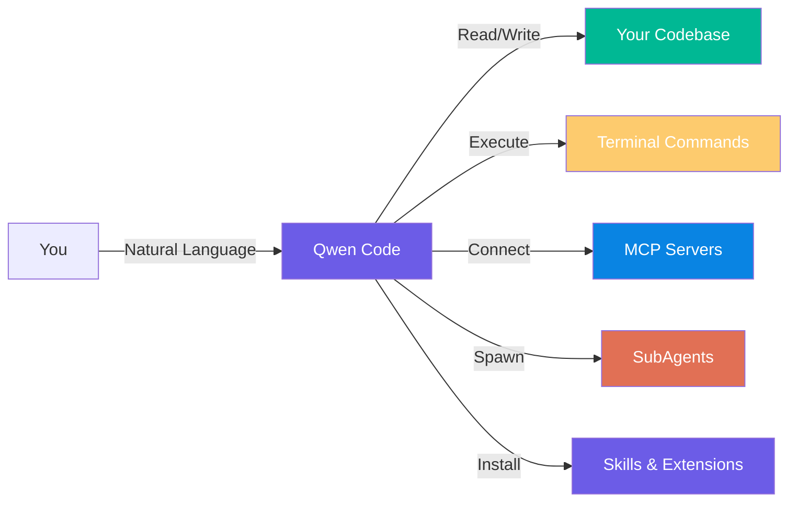
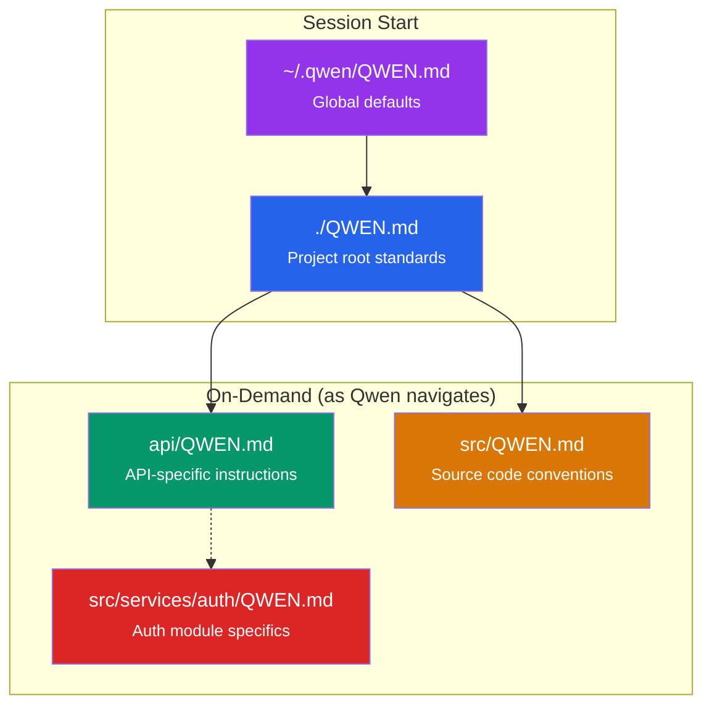
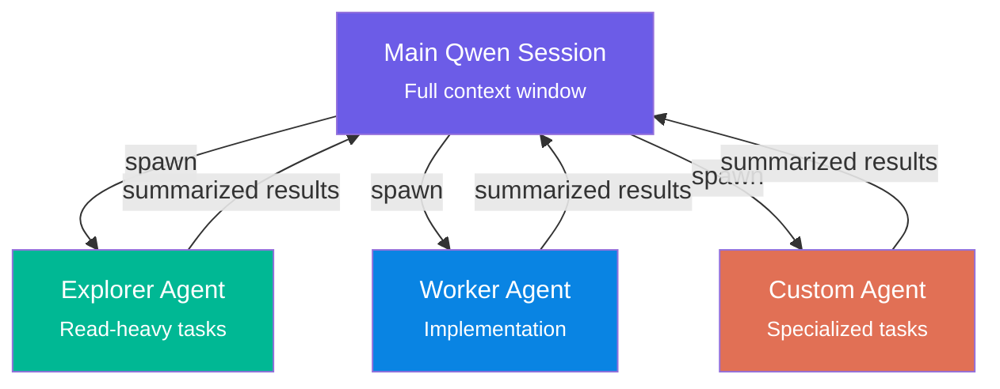
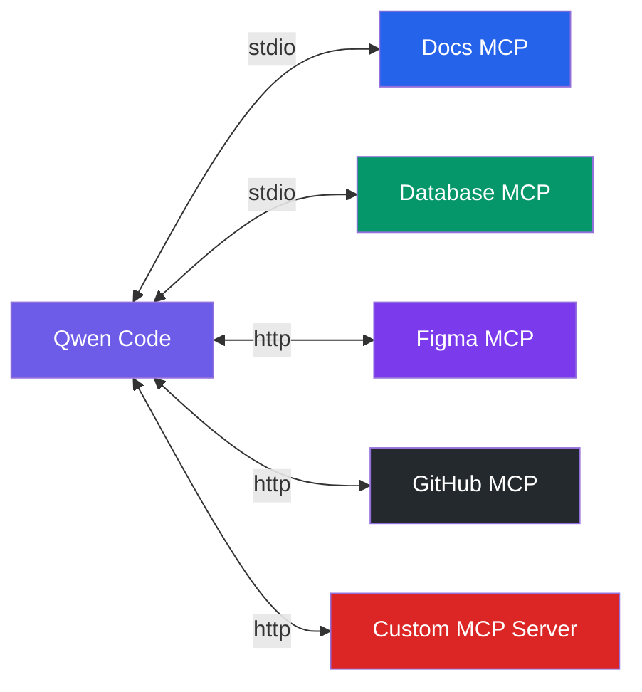
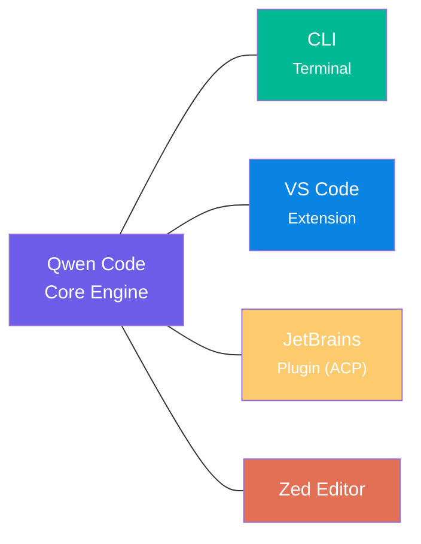
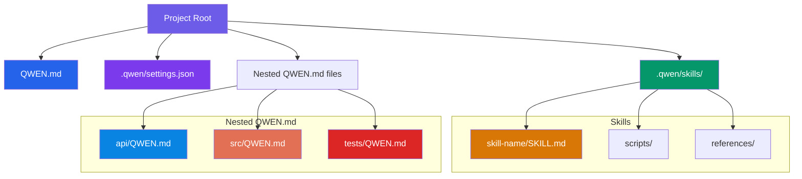

# Qwen Code Guide

## မာတိကာ

- [Qwen Code ဆိုတာ ဘာလဲ?](#qwen-code-ဆိုတာ-ဘာလဲ)
- [စတင်ခြင်း](#စတင်ခြင်း)
- [Authentication - Login နှင့် Access](#authentication---login-နှင့်-access)
- [QWEN.md - ပရောဂျက် ညွှန်ကြားချက်များ](#qwenmd---ပရောဂျက်-ညွှန်ကြားချက်များ)
- [Settings နှင့် Configuration](#settings-နှင့်-configuration)
- [Skills နှင့် Slash Commands](#skills-နှင့်-slash-commands)
- [Agents နှင့် SubAgents](#agents-နှင့်-subagents)
- [MCP (Model Context Protocol)](#mcp-model-context-protocol)
- [Extensions စနစ်](#extensions-စနစ်)
- [CLI ရည်ညွှန်းချက်](#cli-ရည်ညွှန်းချက်)
- [IDE ပေါင်းစပ်မှုများ](#ide-ပေါင်းစပ်မှုများ)
- [Project Structure](#project-structure)
- [နောက်ထပ် ဖတ်ရှုရန်](#နောက်ထပ်-ဖတ်ရှုရန်)

---

## Qwen Code ဆိုတာ ဘာလဲ?

Qwen Code ဆိုတာကို အလွယ်ဆုံး ပြောရရင် Alibaba ရဲ့ Qwen team ကနေ ထုတ်ပေးထားတဲ့ AI coding assistant တစ်ခုပါ။ ဒီကောင်လေးက terminal ထဲမှာ run လို့ရပြီး code တွေကို ဖတ်တာ၊ ရေးတာ၊ ပြင်ဆင်တာတွေအပြင် project တစ်ခုလုံးကို နားလည်ထားတဲ့အတွက် သာမန် စကားပြောသလိုမျိုး prompt ပေးပြီး ခိုင်းလို့ရပါတယ်။ Qwen3-Coder model တွေနဲ့ အထူးအောင် မြင်စွာ အလုပ်လုပ်နိုင်ပြီး OpenAI, Anthropic, Gemini protocol တွေကိုပါ support လုပ်ထားတဲ့အတွက် model ပေါင်းစုံ သုံးနိုင်ပါတယ်။



**ဘယ်နေရာတွေမှာ သုံးလို့ရပြီလဲ ဆိုရင်တော့-** CLI, VS Code Extension, JetBrains IDEs, Zed Editor တွေမှာ အလွယ်တကူ အသုံးပြုနိုင်ပါပြီ။

---

## စတင်ခြင်း

Qwen Code ကို install လုပ်ဖို့ အလွယ်ဆုံးက install script သုံးတာပါပဲ။

```bash
# macOS / Linux
bash -c "$(curl -fsSL https://qwen-code-assets.oss-cn-hangzhou.aliyuncs.com/installation/install-qwen.sh)"

# Windows (Run CMD as Admin)
curl -fsSL -o %TEMP%\install-qwen.bat https://qwen-code-assets.oss-cn-hangzhou.aliyuncs.com/installation/install-qwen.bat && %TEMP%\install-qwen.bat

# Homebrew (macOS/Linux)
brew install qwen-code

# Manual install via npm
npm install -g @qwen-code/qwen-code@latest

# Version check
qwen --version

# Update to latest
npm install -g @qwen-code/qwen-code@latest
```

**လိုအပ်ချက်များ-** Node.js 20+ လိုအပ်ပါတယ်။ Install လုပ်ပြီးရင် terminal ကို restart ပြန်လုပ်ပေးပါ။

### Session စတင်ခြင်း

```bash
# Interactive session စတင်ရန်
qwen

# သီးသန့် prompt ဖြင့် စတင်ရန် (headless mode)
qwen -p "explain this codebase"

# YOLO mode - အလိုအလျောက် vision switching (prompt မေးခွန်းမရှိ)
qwen --yolo

# Approval mode - လုံခြုံစွာ အသုံးပြုရန်
qwen --approval-mode
```

**မှတ်ထားသင့်တဲ့ အချက်တွေ-**
- ပထမဆုံး `qwen` run လုပ်တဲ့အခါ authentication setup လုပ်ခိုင်းပါလိမ့်မယ်။
- Project directory ထဲမှာ run လုပ်တာ အကောင်းဆုံးပါပဲ။

---

## Authentication - Login နှင့် Access

Qwen Code မှာ authentication နည်း (၂) မျိုး ရှိပါတယ်။

- **Qwen OAuth (အကြံပြုထားပြီး အခမဲ့)**: တစ်နေ့ကို 1,000 requests အထိ အခမဲ့ သုံးနိုင်ပါတယ်
- **API Key**: OpenAI-compatible, Anthropic, Google GenAI provider တွေနဲ့ သုံးနိုင်ပါတယ်

### Qwen OAuth (အကြံပြုထား)

```bash
# /auth command သုံးပြီး browser flow ဖြင့် login လုပ်ရန်
/auth
```

> **သတိထားရန်-** OAuth က headless/CI environments တွေမှာ support မလုပ်ပါဘူး။

### API Key Configuration

1. `qwen` ကို run လုပ်ပါ
2. ↑/↓ arrow keys နဲ့ **Alibaba Cloud Bailian Coding Plan** ကို ရွေးပါ
3. Provider `aliyun.com` ကို ရွေးပါ (Base URL auto-configure လုပ်ပေးပါမည်)
4. **Coding Plan API Key** ထည့်သွင်းပါ

### settings.json နဲ့ Configure လုပ်ခြင်း

```json
// ~/.qwen/settings.json (Global)
// .qwen/settings.json (Project)
{
  "modelProviders": {
    "openai": [
      {
        "id": "gpt-4",
        "name": "GPT-4",
        "baseUrl": "https://api.openai.com/v1",
        "envKey": "OPENAI_API_KEY"
      }
    ],
    "anthropic": [
      {
        "id": "claude-sonnet-4-20250514",
        "name": "Claude Sonnet 4",
        "baseUrl": "https://api.anthropic.com",
        "envKey": "ANTHROPIC_API_KEY"
      }
    ]
  },
  "security": {
    "auth": {
      "selectedType": "api-key"
    }
  },
  "model": {
    "name": "qwen3-coder-plus"
  }
}
```

### ထောက်ပံ့ထားသော Models များ (Bailian Coding Plan မှတစ်ဆင့်)

| Model | ရည်ရွယ်ချက် |
|-------|------------|
| `qwen3.5-plus` | အထွေထွေ coding tasks |
| `qwen3-coder-plus` | coding agent အတွက် optimize လုပ်ထား |
| `qwen3-coder-next` | ရှေ့ပြေး coding capabilities |
| `qwen3-max-2026-01-23` | ရှုပ်ထွေးသော reasoning tasks |
| `glm-4.7`, `glm-5` | ZhipuAI models |
| `MiniMax-M2.5` | MiniMax model |
| `kimi-k2.5` | Moonshot AI model |

---

## QWEN.md - ပရောဂျက် ညွှန်ကြားချက်များ

QWEN.md ဆိုတာကတော့ Qwen Code ကို ကိုယ်လိုချင်တဲ့အတိုင်း စိတ်ကြိုက်ပြင်ဆင်ဖို့အတွက် အရေးအကြီးဆုံး file ပဲ ဖြစ်ပါတယ်။ Claude Code မှာ `CLAUDE.md` ရှိသလို၊ Codex မှာ `AGENTS.md` ရှိသလို Qwen Code မှာတော့ **`QWEN.md`** က project instruction file အဓိက ဖြစ်ပါတယ်။

Qwen က အလုပ်မစခင် QWEN.md ကို ဖတ်ပြီး အဲဒီ project ရဲ့ working agreements, build commands, coding rules, testing rules, architecture notes တွေကို context ထဲ ထည့်သွားပါတယ်။

### `/init` နဲ့ QWEN.md ဖန်တီးခြင်း

Qwen Code ထဲမှာ `/init` command သုံးပြီး current directory အတွက် `QWEN.md` scaffold တစ်ခု အလိုအလျောက် generate လုပ်လို့ရပါတယ်။

```text
/init
```

ဒီ command က လက်ရှိ directory ကို analyze လုပ်ပြီး project structure, tech stack, build commands, coding patterns တွေကို လေ့လာကာ QWEN.md ကို auto-generate လုပ်ပေးပါတယ်။

### Manual QWEN.md ဖန်တီးခြင်း

```markdown
# QWEN.md

# Project: My App

## Stack
TypeScript, React, Node.js, PostgreSQL

## Commands
- `npm run dev` - start dev server
- `npm test` - run tests
- `npm run lint` - lint code

## Rules
- Use functional components with hooks
- All API routes need input validation with zod
- Write tests for new features
- Always run lint before committing
```

### Multi-level QWEN.md Structure

Claude Code လိုပဲ Qwen Code မှာလည်း hierarchical context system ရှိနိုင်ပါတယ်။

```
my-project/
  QWEN.md                        # Global: build commands, coding standards
  api/
    QWEN.md                      # API: REST conventions, auth patterns
  src/
    QWEN.md                      # Source: component patterns, state management
    services/
      QWEN.md                    # Services: dependency injection, logging rules
      auth/
        QWEN.md                  # Auth: token handling, session rules
    components/
      QWEN.md                    # Components: prop patterns, styling approach
  tests/
    QWEN.md                      # Tests: fixture patterns, mocking strategy
  docs/
    QWEN.md                      # Docs: writing style, structure
```

### Loading Order



**အဓိက အချက်များ-**
- Root QWEN.md ကို session စတိုင်းမှာ load လုပ်ထားပါတယ်
- Subdirectory QWEN.md တွေကို Qwen က အဲဒီ directory ထဲ ဝင်ရောက်ကိုင်တွယ်တဲ့အခါမှ load လုပ်ပေးပါတယ်
- Context management အတွက် file size ကို သင့်တင့်မျှတအောင် ထားပါ

---

## Settings နှင့် Configuration

Qwen Code ရဲ့ settings တွေကို နေရာ (၂) ခုမှာ သိမ်းထားပါတယ်-

- **Global settings:** `~/.qwen/settings.json`
- **Project settings:** `<repo>/.qwen/settings.json` (global settings ကို override လုပ်နိုင်ပါတယ်)

### Key Settings Fields

```json
{
  "modelProviders": {
    "openai": [
      {
        "id": "gpt-4",
        "name": "GPT-4",
        "baseUrl": "https://api.openai.com/v1",
        "envKey": "OPENAI_API_KEY"
      }
    ]
  },
  "env": {
    "OPENAI_API_KEY": "sk-...",
    "ANTHROPIC_API_KEY": "sk-ant-..."
  },
  "security": {
    "auth": {
      "selectedType": "oauth"
    }
  },
  "model": {
    "name": "qwen3-coder-plus"
  },
  "codingPlan": {
    "region": "cn-hangzhou",
    "version": "latest"
  }
}
```

### Settings CLI Commands

```text
/settings       # Settings editor ဖွင့်ရန် (language, theme, etc.)
/model          # Current session model ပြောင်းရန်
/auth           # Authentication method ပြောင်းရန်
```

### Environment Variables

```bash
# API Key set လုပ်ရန်
export BAILIAN_CODING_PLAN_API_KEY="your-api-key"

# OpenAI-compatible provider အတွက်
export OPENAI_API_KEY="sk-..."
export OPENAI_BASE_URL="https://your-proxy.com/v1"
```

---

## Skills နှင့် Slash Commands

### Skills ဆိုတာဘာလဲ?

Skills ဆိုတာ Qwen Code ရဲ့ capabilities တွေကို တိုးချဲ့ပေးတဲ့ reusable workflow တွေပါ။ Task-specific instructions, scripts, references တွေကို package လုပ်ထားတာဖြစ်ပါတယ်။

### Skills Installation

```bash
# Skill add လုပ်ရန်
npx skills add https://github.com/vercel-labs/skills --skill find-skills -y -a qwen-code

# Skill သုံးရန်
/skills <skill-name> <prompt>

# ဥပမာ
/skills web-component-design based on @website.png create a landing page
```

### Slash Commands

Qwen Code CLI မှာ `/` ရိုက်လိုက်တာနဲ့ command menu ဖွင့်နိုင်ပါတယ်။

| Command | လုပ်ဆောင်ချက် |
|---------|---------------|
| `/init` | Directory analyze လုပ်ပြီး QWEN.md ဖန်တီးသည် |
| `/model` | Current session model ပြောင်းသည် |
| `/auth` | Authentication method ပြောင်းသည် |
| `/clear` | Terminal clear လုပ်ပြီး chat အသစ်စသည် |
| `/compress` | Chat history ကို summarize လုပ်ပြီး token သက်သာစေသည် |
| `/settings` | Settings editor ဖွင့်သည် (language, theme, etc.) |
| `/summary` | Project summary ဖန်တီးသည် |
| `/resume` | ယခင် session ပြန်ဖွင့်သည် |
| `/stats` | Session statistics ကြည့်သည် |
| `/skills` | Skills ကို invoke လုပ်သည် |
| `/extensions` | Extensions manage လုပ်သည် |
| `/help` သို့ `/?` | Help ပြသည် |
| `/quit` သို့ `/exit` | Qwen Code မှ ထွက်သည် |
| `/bug` | Bug report တင်သည် |

### အသုံးဝင်တဲ့ workflow များ

```text
/init                        # QWEN.md generate
/model qwen3-coder-plus     # Model switch
/compress                    # Context compress
/stats                       # Session stats
/summary                     # Project summary
/resume                      # Resume previous session
```

---

## Agents နှင့် SubAgents

Qwen Code မှာ agentic workflow အတွက် **SubAgents** system ပါဝင်ပါတယ်။ ရှုပ်ထွေးတဲ့ task တွေကို subagents တွေဆီ delegate လုပ်ပြီး အပြိုင်အလုပ်လုပ်စေနိုင်ပါတယ်။

### SubAgents အလုပ်လုပ်ပုံ



### အဓိက အချက်များ

- SubAgent တစ်ခုစီမှာ ကိုယ်ပိုင် context window ရှိပါတယ်
- ရလဒ်တွေကို ပင်မ session ကို summarized အဖြစ် ပြန်ပို့ပါတယ်
- Token သုံးစွဲမှု ပိုများနိုင်တာကြောင့် လိုအပ်မှသာ သုံးပါ

---

## MCP (Model Context Protocol)

MCP ကတော့ Qwen Code ကို third-party tools, databases, APIs, design tools, browser tooling တွေနဲ့ ချိတ်ဆက်ပေးတဲ့ protocol ဖြစ်ပါတယ်။ Claude Code နဲ့ Codex CLI မှာလိုပါပဲ။



### MCP Configuration

MCP server တွေကို settings.json မှာ configure လုပ်နိုင်ပါတယ်။

```json
{
  "mcpServers": {
    "github": {
      "type": "http",
      "url": "https://api.github.com/mcp",
      "headers": {
        "Authorization": "Bearer $GITHUB_TOKEN"
      }
    },
    "postgres": {
      "type": "stdio",
      "command": "npx",
      "args": ["-y", "@modelcontextprotocol/server-postgres"],
      "env": {
        "DATABASE_URL": "$DATABASE_URL"
      }
    }
  }
}
```

### Server အမျိုးအစားများ

| အမျိုးအစား | ပို့ဆောင်မှု | မည်သည့်အချိန်တွင် အသုံးပြုရန် |
|------|-----------|------------|
| `stdio` | ဒေသတွင်း သီးခြားလုပ်ငန်းစဉ် | CLI ကိရိယာများ၊ ဒေသတွင်း ဝန်ဆောင်မှုများ |
| `http` | HTTP တောင်းဆိုမှုများ | အဝေးရောက် APIs၊ cloud ဝန်ဆောင်မှုများ |

---

## Extensions စနစ်

Qwen Code မှာ extensions system ပါဝင်ပြီး community-built extensions တွေကို install လုပ်နိုင်ပါတယ်။

```text
# Extension install လုပ်ရန်
/extensions install <author/repo>

# ဥပမာ - Agents extension
/extensions install wshobson/agents
```

### Extensions အသုံးပြုခြင်း

Extensions တွေကို install လုပ်ပြီးရင် Qwen Code session ထဲကနေ တိုက်ရိုက် invoke လုပ်နိုင်ပါတယ်။

---

## CLI ရည်ညွှန်းချက်

### Core Commands

```bash
qwen                                  # Interactive session
qwen -p "Explain this codebase"       # Headless mode (one-off prompt)
qwen --yolo                           # YOLO mode (auto vision switching)
qwen --approval-mode                  # Approval mode enabled
qwen --version                        # CLI version check
qwen --help                           # Help menu
```

### Keyboard Shortcuts

| shortcut | လုပ်ဆောင်ချက် |
|----------|--------|
| **Ctrl+C** | Current operation cancel |
| **Ctrl+D** | Exit (on empty line) |
| **↑ / ↓** | History navigation / menu navigation |
| **Enter** | Confirm selection |
| **@** | File reference (e.g., `@src/main.ts`) |

### File References

Interactive session ထဲမှာ `@` သုံးပြီး local file တွေကို context ထဲ ထည့်နိုင်ပါတယ်။

```text
@src/main.ts explain this function
@README.md summarize this document
@package.json what dependencies do I have?
```

### Headless Mode (Scripts & CI/CD)

```bash
# One-off prompt
qwen -p "Summarize the repository structure"

# Pipe နဲ့ သုံးခြင်း
cat error.log | qwen -p "Diagnose this error"
git diff | qwen -p "Review these changes"

# Output redirect
qwen -p "Generate types from API" > types.ts
```

### Session Management

```text
/clear        # Clear current session
/resume       # Resume previous session
/compress     # Compress chat history to save tokens
/stats        # Show session statistics
/summary      # Generate project summary
```

---

## IDE ပေါင်းစပ်မှုများ



### VS Code Extension

**လိုအပ်ချက်:** VS Code version ≥ 1.85.0

**ထည့်သွင်းရန်:**
1. VS Code Marketplace မှာ "Qwen Code Companion" ကို ရှာပါ
2. Install လုပ်ပါ
3. Top-right icon ကို နှိပ်ပြီး ဖွင့်ပါ

**အဓိက လုပ်ဆောင်ချက်များ:**
- Chat panel ဖြင့် codebase ကို discuss လုပ်နိုင်သည်
- `/model` command ဖြင့် model ပြောင်းနိုင်သည်
- File reference ပါဝင်သည်
- CLI commands အနည်းငယ်ကိုသာ support လုပ်သည်

### JetBrains IDE Plugin

JetBrains IDEs (IntelliJ, PyCharm, WebStorm) တွေမှာ **Agent Client Protocol (ACP)** ကို သုံးပြီး connect လုပ်ရပါတယ်။

**Setup:**
1. AI Chat → Add Custom Agent
2. အောက်ပါ configuration ထည့်ပါ:

```json
{
  "agent_servers": {
    "qwen": {
      "command": "/path/to/qwen",
      "args": ["--acp"],
      "env": {}
    }
  }
}
```

### Zed Editor

Zed Editor မှာလည်း Qwen Code ကို built-in support နဲ့ အသုံးပြုနိုင်ပါတယ်။

---

## Project Structure

Qwen Code project တစ်ခုကို စနစ်တကျ ပြင်ဆင်ထားမယ်ဆိုရင် structure က ဒီလိုမျိုး ဖြစ်လာနိုင်ပါတယ်။



### Folder Structure

```
your-project/
  QWEN.md                           # Project-wide instructions
  api/
    QWEN.md                         # API-specific rules
  src/
    QWEN.md                         # Source code conventions
  tests/
    QWEN.md                         # Testing patterns
  .qwen/
    settings.json                   # Project settings
    skills/
      web-component-design/
        SKILL.md
        scripts/
        references/
```

### Global Settings Location

```
~/.qwen/
  settings.json                     # Global settings (API keys, providers, etc.)
```

### Minimal Quick Start

တကယ်လို့ အရမ်းမရှုပ်စေချင်ဘူးဆိုရင် file တစ်ခုတည်းနဲ့တင် စလို့ရပါတယ်။

**QWEN.md:**
```markdown
# Project: My App

## Stack
TypeScript, React, Node.js, PostgreSQL

## Commands
- `npm run dev` - start dev server
- `npm test` - run tests
- `npm run lint` - lint code

## Rules
- Use functional components with hooks
- All API routes need input validation with zod
- Write tests for new features
- Always run lint before committing
- Ask before adding new dependencies
```

ဒီလောက်နဲ့တင် Qwen Code ကို လက်တွေ့ workflow တော်တော်များများမှာ အသုံးချလို့ရသွားပါပြီ။ `/init` command သုံးပြီး auto-generate လုပ်ခိုင်းလို့လည်း ရပါတယ်။

---

## နောက်ထပ် ဖတ်ရှုရန်

- **တရားဝင် မှတ်တမ်းများ:** [Alibaba Cloud Model Studio - Qwen Code](https://www.alibabacloud.com/help/en/model-studio/qwen-code-coding-plan)
- **GitHub Repository:** [github.com/QwenLM/qwen-code](https://github.com/QwenLM/qwen-code)
- **အက်ပ်တွင်း အကူအညီ:** မည်သည့် Qwen Code Session တွင်မဆို `/help` ဟု ရိုက်ထည့်ပါ
